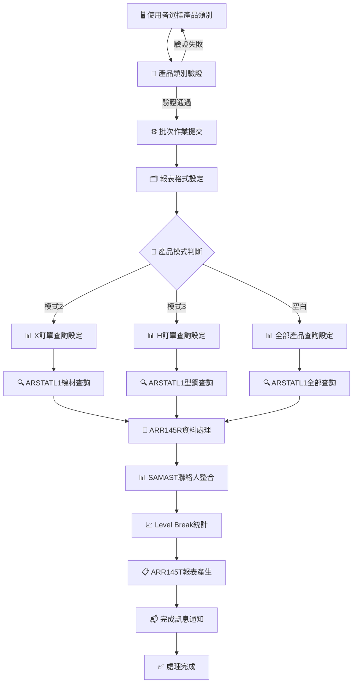
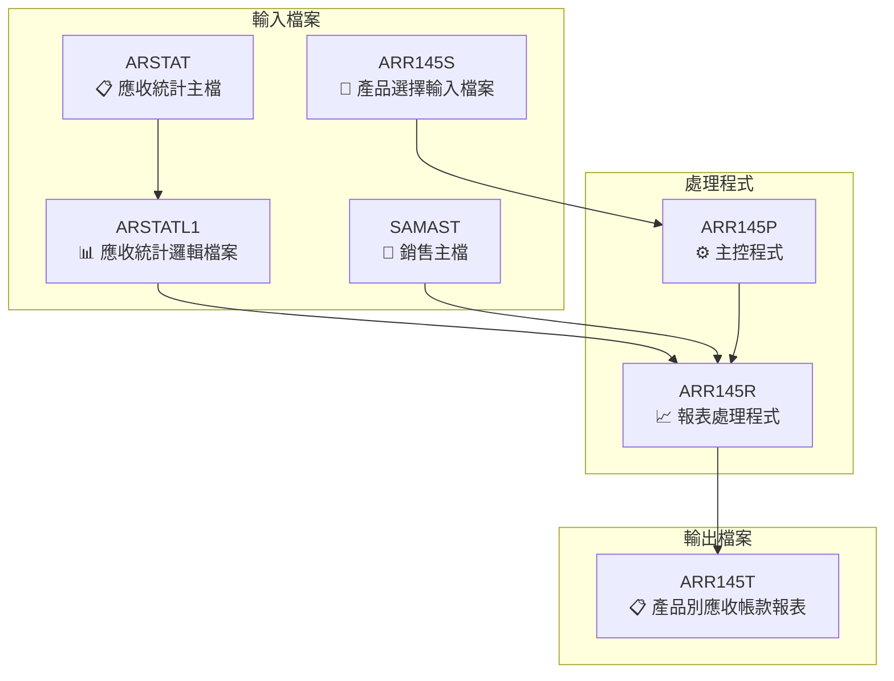
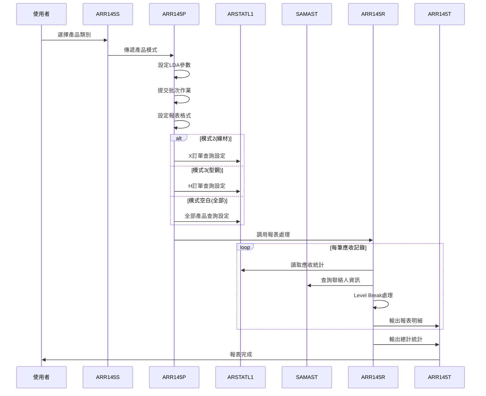
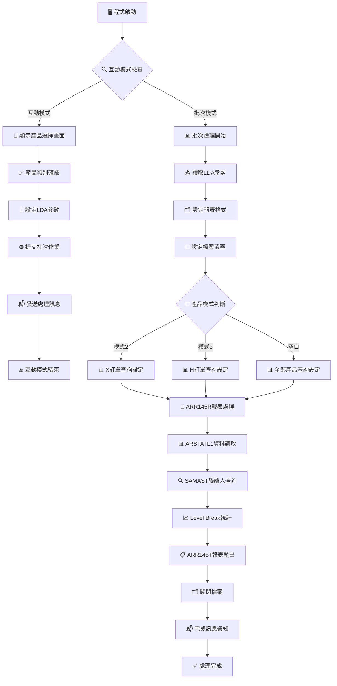

# ARR145P_P02 程式規格書

## 1. 基本資料

| 項目 | 內容 |
|------|------|
| **程式編號** | ARR145P |
| **程式名稱** | 產品別應收帳款查詢報表 |
| **程式類型** | CLP |
| **廠區** | P02 |
| **系統名稱** | 應收帳款系統 |
| **子系統** | 應收帳款查詢子系統 |
| **檔案位置** | 東鋼list/ARR145P_P02.txt |

## 2. 🎯 程式功能說明

### 📋 核心功能

ARR145P_P02是一個專業的產品別應收帳款查詢報表程式，主要功能為：

1. **三模式產品分類查詢**
   - 模式2：線材產品(X訂單)應收帳款查詢
   - 模式3：型鋼產品(H訂單)應收帳款查詢
   - 模式空白：全部產品應收帳款查詢
   - 支援靈活的產品分類選擇

2. **應收統計資料處理**
   - 基於ARSTATL1檔案的應收統計查詢
   - 排除零餘額和特定訂單的資料過濾
   - 以"E"開頭客戶代號的專門查詢
   - 支援多維度的資料篩選條件

3. **訂單分類處理機制**
   - X訂單：線材產品的專業處理
   - H訂單：型鋼產品的專業處理
   - V00003訂單：特殊訂單的排除處理
   - 訂單首字元的智能分類識別

4. **銷售聯絡人資訊整合**
   - 整合SAMAST銷售主檔資料
   - 取得聯絡人電話資訊
   - 支援客戶聯絡資訊的完整顯示
   - 提供業務聯繫的便利功能

5. **多層級統計分析**
   - 客戶層級的Level Break處理
   - 銷售金額、預收金額、利息金額統計
   - 餘額金額的精確計算
   - 總計和小計的完整分析

### 🔄 業務流程



### 🎯 關鍵特色

**智能產品分類機制**
- 透過訂單首字元自動識別產品類型
- X訂單專門處理線材產品的應收帳款
- H訂單專門處理型鋼產品的應收帳款
- 空白模式提供全產品類型的綜合查詢

**精確的查詢條件控制**
- ARNBAL≠0確保只查詢有餘額的應收帳款
- CUNO="E"限定特定客戶類型的查詢
- ARORNO≠"V00003"排除特殊訂單的干擾
- %SST函數實現訂單號碼和客戶號碼的首字元切割

**Level Break多層級統計**
- 客戶代號(ARCUNO)的L1 Level Break處理
- 自動計算客戶層級的小計金額
- 報表最終提供總計統計資訊
- 支援銷售、預收、利息、餘額等多項目統計

**銷售資訊完整整合**
- 透過SAMAST檔案取得聯絡人資訊
- S1OREA和S1ORNO的複合鍵值查詢
- 聯絡人電話(S1CTNO)的完整顯示
- 提供業務人員完整的客戶聯繫資訊

## 3. 🎯 檔案架構與關聯圖

### 🗂️ 檔案關聯架構



### 🔄 資料流程序列圖



## 4. 🎯 檔案欄位規格說明

### 🔧 主要資料結構

#### **LDA參數區域結構**

| 位置 | 長度 | 欄位名稱 | 型態 | 說明 |
|------|------|----------|------|------|
| 1 | 1 | W#PROD | CHAR | 產品類別('2'/'3'/' ') |
| 517-526 | 10 | DSPID | CHAR | 顯示設備ID |
| 951-985 | 35 | S#COMP | CHAR | 公司名稱 |
| 1001-1010 | 10 | T#USID | CHAR | 使用者ID |
| 1011-1020 | 10 | S#DEVI | CHAR | 設備名稱 |

#### **程式變數定義表**

| 變數名稱 | 型態 | 長度 | 用途說明 |
|----------|------|------|----------|
| DSPID | CHAR | 10 | 顯示設備ID |
| OUTQ | CHAR | 10 | 輸出佇列名稱 |
| INT | CHAR | 1 | 互動式標識 |
| QDATE | CHAR | 8 | 系統日期 |
| W#PROD | CHAR | 1 | 產品類別模式 |
| W#ERR | CHAR | 1 | 錯誤標識 |

#### **ARSTATL1檔案結構**

| 欄位名稱 | 型態 | 長度 | 說明 |
|----------|------|------|------|
| ARCUNO | CHAR | 6 | 客戶代號 |
| ARCUNM | CHAR | 10 | 客戶名稱 |
| ARORNO | CHAR | 6 | 訂單號碼 |
| ARAAMT | PACKED | 11,0 | 銷售金額 |
| ARBAMT | PACKED | 11,0 | 預收金額 |
| ARIAMT | PACKED | 11,0 | 利息金額(發票) |
| ARJAMT | PACKED | 11,0 | 利息金額(預收) |
| ARNBAL | PACKED | 11,0 | 最新餘額 |

#### **SAMAST檔案結構**

| 欄位名稱 | 型態 | 長度 | 說明 |
|----------|------|------|------|
| S1OREA | CHAR | 1 | 訂單區域代碼 |
| S1ORNO | CHAR | 5 | 訂單號碼 |
| S1CTNO | CHAR | 10 | 聯絡人電話 |

### 🔍 重點欄位切割技術詳解

#### **LDA參數區域切割視覺化**

##### LDA參數區域切割視覺化：
```
LDA記錄：[P.........................................................................................................................................................517-526.....COMP___________________________UUUUUUUUUUDDDDDDDDD]
位置:    001                                                                                                                                  517-526      951-985                       1001-10   1011-20
         ↓                                                                                                                                    ↓            ↓                             ↓         ↓
產品模式: [2]                                                                                                                                              1字元產品類別
前段保留: [.........................................................................................................................................................]  516字元保留區域
設備ID:                                                                                                                                       [TERM001WS_]                                     10字元設備識別
公司名稱:                                                                                                                                                  [東莞鋼鐵股份有限公司_______________]           35字元公司名稱
使用者ID:                                                                                                                                                                                     [S00WCJ____]  10字元使用者識別
設備名稱:                                                                                                                                                                                               [TERM001WS] 10字元設備名稱
```

##### LDA切割邏輯說明
**切割策略**：LDA單點式產品參數切割法，透過CHGDTAARA/RTVDTAARA指令進行精確位置的產品模式讀寫
- **產品模式區**：位置1存放產品類別選擇('2'/'3'/' ')
- **設備資訊區**：位置517-526存放設備ID
- **系統資訊區**：位置951-985存放公司名稱
- **使用者資訊區**：位置1001-1020存放使用者和設備資訊

#### **ARSTATL1查詢條件欄位切割視覺化**

##### 模式2(線材)查詢條件切割視覺化：
```
ARSTATL1記錄：[CUNO__|CUNM______|ORNO__|ARAAMT_____|ARBAMT_____|ARIAMT_____|ARJAMT_____|ARNBAL_____|...]
位置:         001-6  007-16     017-22 023-33     034-44     045-55     056-66     067-77
              ↓      ↓          ↓      ↓          ↓          ↓          ↓          ↓
客戶代號:     [E99999]                                                                                6字元客戶代號
客戶名稱:            [東興企業___]                                                                    10字元客戶名稱
訂單號碼:                     [X12345]                                                              6字元訂單號碼
銷售金額:                            [1000000000]                                                   11位銷售金額
預收金額:                                       [0500000000]                                        11位預收金額
利息金額(發票):                                              [0010000000]                          11位利息金額
利息金額(預收):                                                         [0005000000]               11位利息金額
最新餘額:                                                                          [0505000000]     11位最新餘額

查詢條件切割：
1. ORNO = "X" → %SST(ARORNO 1 1) *EQ "X" (訂單首字元為X)
2. ARNBAL *NE 0 → 排除零餘額記錄
3. CUNO = "E" → %SST(ARCUNO 1 1) *EQ "E" (客戶首字元為E)
```

##### 模式3(型鋼)查詢條件切割視覺化：
```
ARSTATL1記錄：[CUNO__|CUNM______|ORNO__|ARAAMT_____|ARBAMT_____|ARIAMT_____|ARJAMT_____|ARNBAL_____|...]
位置:         001-6  007-16     017-22 023-33     034-44     045-55     056-66     067-77
              ↓      ↓          ↓      ↓          ↓          ↓          ↓          ↓
客戶代號:     [E88888]                                                                                6字元客戶代號
客戶名稱:            [型鋼公司___]                                                                    10字元客戶名稱
訂單號碼:                     [H54321]                                                              6字元訂單號碼
銷售金額:                            [2000000000]                                                   11位銷售金額
預收金額:                                       [1000000000]                                        11位預收金額
利息金額(發票):                                              [0020000000]                          11位利息金額
利息金額(預收):                                                         [0010000000]               11位利息金額
最新餘額:                                                                          [1030000000]     11位最新餘額

查詢條件切割：
1. ORNO = "H" → %SST(ARORNO 1 1) *EQ "H" (訂單首字元為H)
2. ARNBAL *NE 0 → 排除零餘額記錄
3. CUNO = "E" → %SST(ARCUNO 1 1) *EQ "E" (客戶首字元為E)
```

##### 模式空白(全部)查詢條件切割視覺化：
```
ARSTATL1記錄：[CUNO__|CUNM______|ORNO__|ARAAMT_____|ARBAMT_____|ARIAMT_____|ARJAMT_____|ARNBAL_____|...]
位置:         001-6  007-16     017-22 023-33     034-44     045-55     056-66     067-77
              ↓      ↓          ↓      ↓          ↓          ↓          ↓          ↓
客戶代號:     [E77777]                                                                                6字元客戶代號
客戶名稱:            [綜合企業___]                                                                    10字元客戶名稱
訂單號碼:                     [G99999]                                                              6字元訂單號碼
銷售金額:                            [3000000000]                                                   11位銷售金額
預收金額:                                       [1500000000]                                        11位預收金額
利息金額(發票):                                              [0030000000]                          11位利息金額
利息金額(預收):                                                         [0015000000]               11位利息金額
最新餘額:                                                                          [1545000000]     11位最新餘額

查詢條件切割：
1. ARNBAL *NE 0 → 排除零餘額記錄
2. ARORNO *NE "V00003" → 排除特殊訂單V00003
3. CUNO = "E" → %SST(ARCUNO 1 1) *EQ "E" (客戶首字元為E)
```

#### **SAMAST聯絡人檔案欄位切割視覺化**

##### SAMAST聯絡人查詢切割視覺化：
```
SAMAST記錄：[S1OREA|S1ORNO|S1CTNO____|...]
位置:       001    002-6  007-16
            ↓      ↓      ↓
訂單區域:   [X]                         1字元訂單區域代碼
訂單號碼:          [12345]             5字元訂單號碼
聯絡電話:                 [0928123456] 10字元聯絡人電話

ARORNO切割重組：
ARORNO原始: [X12345] → 切割為 S1OREA=[X] + S1ORNO=[12345]
                      ↓
                    Data Structure切割
                      ↓
KEY01複合鍵: [X] + [12345] → CHAIN SAMAST查詢聯絡人資訊
```

#### **三模式查詢欄位切割對應表**
| 切割來源 | 切割目標 | 切割位置 | 切割邏輯 | 技術實現 |
|----------|----------|----------|----------|----------|
| **LDA參數** | W#PROD | 位置1 | 產品模式參數傳遞 | CHGDTAARA/RTVDTAARA |
| **LDA參數** | DSPID | 位置517-526 | 設備ID參數傳遞 | CHGDTAARA/RTVDTAARA |
| **LDA參數** | S#COMP | 位置951-985 | 公司名稱參數傳遞 | CHGDTAARA/RTVDTAARA |
| **LDA參數** | T#USID | 位置1001-1010 | 使用者ID參數傳遞 | CHGDTAARA/RTVDTAARA |
| **LDA參數** | S#DEVI | 位置1011-1020 | 設備名稱參數傳遞 | CHGDTAARA/RTVDTAARA |
| **模式邏輯** | W#PROD | '2'/'3'/' ' | 三模式切割邏輯 | IF COND檢查 |
| **ARSTATL1** | ORNO | %SST(ARORNO 1 1) | 訂單首字元切割 | MAPFLD函數 |
| **ARSTATL1** | CUNO | %SST(ARCUNO 1 1) | 客戶首字元切割 | MAPFLD函數 |
| **ARORNO** | S1OREA | 位置1 | 訂單區域切割 | Data Structure |
| **ARORNO** | S1ORNO | 位置2-6 | 訂單號碼切割 | Data Structure |
| **SAMAST** | S1CTNO | 完整欄位 | 聯絡電話對應 | CHAIN查詢 |
| **ARR145R** | T#AAMT | ARAAMT | 銷售金額對應 | 直接對應 |
| **ARR145R** | T#BAMT | ARBAMT+AREAMT+ARGAMT+ARHAMT | 預收金額合計 | 加總計算 |
| **ARR145R** | T#EAMT | ARIAMT+ARJAMT | 利息金額合計 | 加總計算 |
| **ARR145R** | T#NBAL | ARNBAL | 餘額金額對應 | 直接對應 |
| **Level Break** | ARCUNO | L1欄位 | 客戶Level Break切割 | RPG Level Break |

### 🎯 欄位挪用詳細分析

#### **三模式查詢條件挪用機制**

**模式2：線材產品(X訂單)挪用**
- `W#PROD='2'` → 建立X訂單專用查詢條件
- `ORNO *EQ "X"` → 使用%SST(ARORNO 1 1)切割訂單首字元
- `ARNBAL *NE 0` → 排除零餘額記錄
- `CUNO *EQ "E"` → 使用%SST(ARCUNO 1 1)切割客戶首字元
- 排序：(ARCUNO) (ARORNO)

**模式3：型鋼產品(H訂單)挪用**
- `W#PROD='3'` → 建立H訂單專用查詢條件
- `ORNO *EQ "H"` → 使用%SST(ARORNO 1 1)切割訂單首字元
- `ARNBAL *NE 0` → 排除零餘額記錄
- `CUNO *EQ "E"` → 使用%SST(ARCUNO 1 1)切割客戶首字元
- 排序：(ARCUNO) (ARORNO)

**模式空白：全部產品挪用**
- `W#PROD=' '` → 建立全產品查詢條件
- `ARNBAL *NE 0` → 排除零餘額記錄
- `ARORNO *NE "V00003"` → 排除特殊訂單V00003
- `CUNO *EQ "E"` → 使用%SST(ARCUNO 1 1)切割客戶首字元
- 排序：(ARCUNO) (ARORNO)

#### **MAPFLD欄位切割挪用分析**

**ARORNO訂單號碼切割挪用**
```
MAPFLD切割邏輯：
(ORNO '%SST(ARORNO 1 1)') → 取訂單號碼第1個字元
原始值: ARORNO = "X12345" → 切割值: ORNO = "X"
原始值: ARORNO = "H54321" → 切割值: ORNO = "H"
原始值: ARORNO = "G99999" → 切割值: ORNO = "G"
```

**ARCUNO客戶代號切割挪用**
```
MAPFLD切割邏輯：
(CUNO '%SST(ARCUNO 1 1)') → 取客戶代號第1個字元
原始值: ARCUNO = "E99999" → 切割值: CUNO = "E"
原始值: ARCUNO = "E88888" → 切割值: CUNO = "E"
原始值: ARCUNO = "D77777" → 切割值: CUNO = "D" (不符合查詢條件)
```

#### **Data Structure欄位重組挪用邏輯**

**ARORNO欄位重組挪用**
```
Data Structure定義：
I            DS
I                                        1   6 ARORNO
I                                        1   1 S1OREA
I                                        2   60S1ORNO

重組邏輯：
ARORNO = "X12345" → S1OREA = "X", S1ORNO = "12345"
ARORNO = "H54321" → S1OREA = "H", S1ORNO = "54321"
ARORNO = "G99999" → S1OREA = "G", S1ORNO = "99999"
```

#### **金額計算挪用邏輯**

**銷售金額直接挪用**
- `T#AAMT` ← `ARAAMT` (銷售金額直接對應)

**預收金額複合挪用**
```
預收金額計算挪用：
T#BAMT = ARBAMT + AREAMT + ARGAMT + ARHAMT
       = 預收金額 + 退回預收金額 + 預收金額退回 + 預收金額
```

**利息金額複合挪用**
```
利息金額計算挪用：
T#EAMT = ARIAMT + ARJAMT
       = 利息金額(發票) + 利息金額(預收)
```

**餘額金額直接挪用**
- `T#NBAL` ← `ARNBAL` (最新餘額直接對應)

#### **Level Break層級挪用邏輯**

**客戶層級Break挪用**
```
Level Break定義：
I                                              ARCUNOL1

累計變數挪用：
T1AAMT → 客戶層級銷售金額小計
T1BAMT → 客戶層級預收金額小計
T1EAMT → 客戶層級利息金額小計
T1NBAL → 客戶層級餘額金額小計

總計變數挪用：
T2AAMT → 總計銷售金額
T2BAMT → 總計預收金額
T2EAMT → 總計利息金額
T2NBAL → 總計餘額金額
```

#### **聯絡人查詢挪用邏輯**

**SAMAST複合鍵查詢挪用**
```
KEY01 KLIST定義：
C           KEY01     KLIST
C                     KFLD           S1OREA
C                     KFLD           S1ORNO

查詢邏輯挪用：
KEY01 CHAIN SAMAST → 取得S1CTNO聯絡電話
找到記錄 → T#CTNO = S1CTNO
找不到記錄 → T#CTNO = *BLANKS
```

### 🔧 切割邏輯說明與技術實現

#### **CLP程式三模式切割邏輯**

**產品模式判斷切割實現**
```
CLP主程式(ARR145P)中的模式處理：

模式2(線材)處理流程：
IF COND(&W#PROD *EQ '2') THEN(DO)
   OPNQRYF    FILE(ARSTATL1) QRYSLT('
              ORNO  *EQ "X" *AND
              ARNBAL *NE 0  *AND
              CUNO  *EQ "E"')
              MAPFLD((ORNO '%SST(ARORNO 1 1)')
                     (CUNO '%SST(ARCUNO 1 1)'))
              KEYFLD((ARCUNO) (ARORNO))
ENDDO

模式3(型鋼)處理流程：
IF COND(&W#PROD *EQ '3') THEN(DO)
   OPNQRYF    FILE(ARSTATL1) QRYSLT('
              ORNO  *EQ "H" *AND
              ARNBAL *NE 0  *AND
              CUNO  *EQ "E"')
              MAPFLD((ORNO '%SST(ARORNO 1 1)')
                     (CUNO '%SST(ARCUNO 1 1)'))
              KEYFLD((ARCUNO) (ARORNO))
ENDDO

模式空白(全部)處理流程：
IF COND(&W#PROD *EQ ' ') THEN(DO)
   OPNQRYF    FILE(ARSTATL1) QRYSLT('
              ARNBAL *NE 0  *AND
              ARORNO *NE "V00003" *AND
              CUNO  *EQ "E"')
              MAPFLD((CUNO '%SST(ARCUNO 1 1)'))
              KEYFLD((ARCUNO) (ARORNO))
ENDDO
```

#### **OPNQRYF MAPFLD切割邏輯實現**

**字串切割函數應用**
```
MAPFLD切割技術：

訂單首字元切割：
MAPFLD((ORNO '%SST(ARORNO 1 1)'))
→ %SST(字串, 起始位置, 長度)
→ %SST(ARORNO, 1, 1) 取第1個字元

客戶首字元切割：
MAPFLD((CUNO '%SST(ARCUNO 1 1)'))
→ %SST(字串, 起始位置, 長度)
→ %SST(ARCUNO, 1, 1) 取第1個字元

實際切割範例：
ARORNO="X12345" → ORNO="X"
ARCUNO="E99999" → CUNO="E"
```

#### **RPG Data Structure切割邏輯實現**

**ARORNO欄位重組切割**
```
RPG程式中的DS定義：

Data Structure定義：
I            DS
I                                        1   6 ARORNO
I                                        1   1 S1OREA
I                                        2   60S1ORNO

切割邏輯實現：
當ARORNO="X12345"時：
→ S1OREA = "X" (位置1-1)
→ S1ORNO = "12345" (位置2-6)

當ARORNO="H54321"時：
→ S1OREA = "H" (位置1-1)  
→ S1ORNO = "54321" (位置2-6)
```

#### **RPG Level Break處理邏輯實現**

**客戶層級Level Break定義**
```
RPG程式中的Level Break定義：

Level Break結構：
I                                              ARCUNOL1

Level Break處理邏輯：
CL1                EXSR L1CLR                          // L1 Break清除
C   01             EXSR DTLSR                          // 明細處理
CL1 99             EXSR L1SR                           // L1 Break小計
CLR 99             EXSR LRSR                           // 最後記錄總計

L1CLR子程序（客戶層級清除）：
C           L1CLR     BEGSR
C                     Z-ADD0         T1AAMT            // 清除客戶小計
C                     Z-ADD0         T1BAMT
C                     Z-ADD0         T1EAMT
C                     Z-ADD0         T1NBAL
C                     ENDSR
```

#### **金額計算邏輯實現**

**複合金額計算處理**
```
明細處理子程序(DTLSR)：

銷售金額計算：
C                     Z-ADDARAAMT    T#AAMT           // 銷售金額直接對應

預收金額複合計算：
C                     Z-ADD0         W#BAMT 120       // 初始化工作變數
C                     Z-ADDARBAMT    W#BAMT            // 加入預收金額
C                     ADD  AREAMT    W#BAMT            // 加入退回預收金額
C                     ADD  ARGAMT    W#BAMT            // 加入預收金額退回
C                     ADD  ARHAMT    W#BAMT            // 加入預收金額
C                     Z-ADDW#BAMT    T#BAMT            // 設定預收總金額

利息金額複合計算：
C                     Z-ADD0         W#EAMT 120       // 初始化工作變數
C                     Z-ADDARIAMT    W#EAMT            // 加入利息金額(發票)
C                     ADD  ARJAMT    W#EAMT            // 加入利息金額(預收)
C                     Z-ADDW#EAMT    T#EAMT            // 設定利息總金額

餘額金額計算：
C                     Z-ADDARNBAL    T#NBAL           // 餘額金額直接對應
```

#### **聯絡人查詢邏輯實現**

**SAMAST複合鍵查詢處理**
```
KLIST和CHAIN邏輯：

複合鍵定義：
C           KEY01     KLIST
C                     KFLD           S1OREA          // 訂單區域
C                     KFLD           S1ORNO          // 訂單號碼

查詢處理：
C           KEY01     CHAINRSAMAST              50
C  N50                MOVELS1CTNO    T#CTNO          // 找到→設定聯絡電話
C   50                MOVEL*BLANKS   T#CTNO          // 找不到→設定空白

指示器說明：
*IN50 = *OFF → 找到記錄，T#CTNO = S1CTNO
*IN50 = *ON  → 找不到記錄，T#CTNO = *BLANKS
```

#### **Level Break累計邏輯實現**

**多層級累計處理**
```
累計邏輯實現：

明細累計（每筆記錄）：
C                     ADD  T#AAMT    T1AAMT          // 加入客戶小計
C                     ADD  T#AAMT    T2AAMT          // 加入總計
C                     ADD  T#BAMT    T1BAMT
C                     ADD  T#BAMT    T2BAMT
C                     ADD  T#EAMT    T1EAMT
C                     ADD  T#EAMT    T2EAMT
C                     ADD  T#NBAL    T1NBAL
C                     ADD  T#NBAL    T2NBAL

L1 Break小計輸出：
C           L1SR      BEGSR
C                     WRITEAR145T2                    // 輸出客戶小計
C                     ENDSR

最後記錄總計輸出：
C           LRSR      BEGSR
C                     WRITEAR145T3                    // 輸出總計
C                     ENDSR
```

### 📊 重要變數定義表

| 變數名稱 | 型態 | 長度 | 初始值 | 用途說明 |
|----------|------|------|--------|----------|
| IN03 | IND | 1 | *OFF | F3離開指示器 |
| IN12 | IND | 1 | *OFF | F12返回指示器 |
| IN50 | IND | 1 | *OFF | SAMAST查詢指示器 |
| IN60 | IND | 1 | *OFF | 客戶代號顯示控制 |
| IN61 | IND | 1 | *OFF | 訂單號碼顯示控制 |
| IN99 | IND | 1 | *OFF | 初始化標識 |
| S#PROD | CHAR | 1 | ' ' | 產品類別選擇 |
| W#PROD | CHAR | 1 | ' ' | 產品類別工作變數 |
| T#USID | CHAR | 10 | LDA取得 | 使用者ID |
| T#PROD | CHAR | 1 | LDA取得 | 產品類別參數 |
| T#AAMT | PACKED | 11,0 | 0 | 銷售金額 |
| T#BAMT | PACKED | 11,0 | 0 | 預收金額 |
| T#EAMT | PACKED | 11,0 | 0 | 利息金額 |
| T#NBAL | PACKED | 11,0 | 0 | 餘額金額 |
| T1AAMT | PACKED | 12,0 | 0 | 客戶小計銷售金額 |
| T1BAMT | PACKED | 12,0 | 0 | 客戶小計預收金額 |
| T1EAMT | PACKED | 12,0 | 0 | 客戶小計利息金額 |
| T1NBAL | PACKED | 12,0 | 0 | 客戶小計餘額金額 |
| T2AAMT | PACKED | 12,0 | 0 | 總計銷售金額 |
| T2BAMT | PACKED | 12,0 | 0 | 總計預收金額 |
| T2EAMT | PACKED | 12,0 | 0 | 總計利息金額 |
| T2NBAL | PACKED | 12,0 | 0 | 總計餘額金額 |

## 5. 🎯 輸出/入螢幕布局

### 📝 輸入畫面規格 (ARR145S)

#### **畫面布局**

```
┌─────────────────────────────────────────────────────────────────────────────┐
│ 2024/12/30            東莞鋼鐵股份有限公司                        ARR145S   │
│ 15:30:25            產品別應收帳款查詢報表                        devname   │
│                                                                             │
│                                                                             │
│                                                                             │
│                                                                             │
│                                                                             │
│        產品類別: _ (2=線材(X訂單) 3=型鋼 空白=全部)                        │
│                                                                             │
│                                                                             │
│                                                                             │
│                                                                             │
│                                                                             │
│                                                                             │
│                                                                             │
│                                                                             │
│                                                                             │
│                                                                             │
│                                                                             │
│                                                                             │
│ ________________________________________________________________           │
│     PF03:離開              PF12:回到前頁                                   │
└─────────────────────────────────────────────────────────────────────────────┘
```

#### **欄位詳細規格**

| 欄位名稱 | 位置 | 型態 | 長度 | 屬性 | 說明 |
|----------|------|------|------|------|------|
| **S#PROD** | 8,25 | 1A | 1 | 輸入欄位 | 產品類別選擇 |
| **S#COMP** | 1,23 | 35A | 35 | 輸出欄位 | 公司名稱 |
| **S#DEVI** | 2,70 | 10A | 10 | 輸出欄位 | 設備名稱 |
| **S#ERR** | 23,2 | 70A | 70 | 輸出欄位 | 錯誤訊息區域(高亮顯示) |

#### **功能鍵說明**

| 功能鍵 | 說明 | 對應指示器 |
|--------|------|------------|
| **ENTER** | 確認產品類別選擇，執行報表處理 | - |
| **F03** | 離開程式 | IN03 |
| **F12** | 回到前一個畫面 | IN12 |

#### **輸入值說明**

| 輸入值 | 說明 | 查詢條件 |
|--------|------|----------|
| **'2'** | 線材產品(X訂單) | ORNO="X" + ARNBAL≠0 + CUNO="E" |
| **'3'** | 型鋼產品(H訂單) | ORNO="H" + ARNBAL≠0 + CUNO="E" |
| **' '** | 全部產品 | ARNBAL≠0 + ARORNO≠"V00003" + CUNO="E" |

### 📊 報表輸出格式

#### **產品別應收帳款查詢報表布局**

```
┌─────────────────────────────────────────────────────────────────────────────────────────────────────────────────────────────────────────────────────────┐
│ 報表代號: ARR145T                             東莞鋼鐵股份有限公司                                                               列印日期: 2024/12/30│
│ 列印人員: S00WCJ                         產品別應收帳款查詢報表                                                               列印時間: 15:30:25  │
│                                                                                                                                頁數: 1     │
│ 產品類別: 2 (2=線材(X訂單) 3=型鋼 空白=全部)                                                                                                  │
│ ═══════════════════════════════════════════════════════════════════════════════════════════════════════════════════════════════════════════════════════  │
│                                                                                                                                              │
│ 客戶代號  客戶名稱    訂單代號  聯絡電話    銷售金額     預收金額     利息金額     餘額金額   │
│ ═══════════════════════════════════════════════════════════════════════════════════════════════════════════════════════════════════════════════════════  │
│ E99999   東興企業    X12345    0928123456    1,000,000      500,000       10,000      510,000 │
│ E99999   東興企業    X12346    0928123456      800,000      400,000        8,000      408,000 │
│ E99999   東興企業    X12347    0928123456      600,000      300,000        6,000      306,000 │
│                                                                                                                                              │
│ ────────────────────────────────────────────────────────────────────────────────────────────────────────────────────────────────────────────────────── │
│                      客戶小計:                                     2,400,000    1,200,000       24,000    1,224,000 │
│ ═══════════════════════════════════════════════════════════════════════════════════════════════════════════════════════════════════════════════════════  │
│                                                                                                                                              │
│ E88888   大同鋼鐵    X23456    0912345678    1,500,000      750,000       15,000      765,000 │
│ E88888   大同鋼鐵    X23457    0912345678    1,200,000      600,000       12,000      612,000 │
│                                                                                                                                              │
│ ────────────────────────────────────────────────────────────────────────────────────────────────────────────────────────────────────────────────────── │
│                      客戶小計:                                     2,700,000    1,350,000       27,000    1,377,000 │
│ ═══════════════════════════════════════════════════════════════════════════════════════════════════════════════════════════════════════════════════════  │
│                                                                                                                                              │
│ 模式2(線材)處理結果:                                                                                                                        │
│ - 查詢條件: 訂單首字元='X' + 餘額不為零 + 客戶首字元='E'                                                                                      │
│ - Level Break: 依客戶代號分組統計                                                                                                           │
│ - 金額計算: 銷售金額+預收金額+利息金額=餘額金額                                                                                              │
│ - 聯絡資訊: 整合SAMAST檔案聯絡人電話                                                                                                        │
│                                                                                                                                              │
│ ═══════════════════════════════════════════════════════════════════════════════════════════════════════════════════════════════════════════════════════  │
│ 總  計:                                                         5,100,000    2,550,000       51,000    2,601,000 │
└─────────────────────────────────────────────────────────────────────────────────────────────────────────────────────────────────────────────────────────┘
```

## 6. 🎯 處理流程程序說明

### 🔄 主要處理流程



### 📝 詳細處理步驟

**步驟1：程式初始化**
- 宣告檔案參考(ARR145S)和程式變數
- 檢查執行模式(互動式/批次)
- 取得作業資訊(使用者、輸出佇列)
- 從LDA讀取公司名稱和設備名稱

**步驟2：互動式參數輸入**
- 透過SNDRCVF顯示ARR145S產品選擇畫面
- 支援產品類別選擇('2'/'3'/' ')
- 提供產品類別說明和功能鍵提示
- 處理F03離開和F12返回功能

**步驟3：LDA參數設定**
- 位置1：產品類別(W#PROD)
- 位置517-526：顯示設備ID(DSPID)
- 確保參數正確傳遞到批次階段

**步驟4：批次作業提交**
- 透過SBMJOB提交批次作業到ARJOBD作業說明
- 發送開始處理訊息給使用者
- 返回互動式作業

**步驟5：批次處理階段**
- 從LDA讀取產品類別和設備ID參數
- 設定ARR145T報表：120字元寬度、15CPI、HOLD
- 設定ARSTATL1檔案為共享模式

**步驟6：產品模式查詢設定**
- 模式2：建立X訂單專用OPNQRYF查詢
- 模式3：建立H訂單專用OPNQRYF查詢
- 空白模式：建立全產品OPNQRYF查詢
- 使用MAPFLD進行欄位切割和重組

**步驟7：報表處理調用**
- 調用ARR145R進行主要報表處理
- ARR145R讀取ARSTATL1查詢結果
- 整合SAMAST聯絡人資訊
- Level Break處理和金額統計

**步驟8：資料讀取與處理**
- 循序讀取ARSTATL1應收統計資料
- 透過複合鍵查詢SAMAST聯絡人電話
- 進行金額計算和累計處理
- Level Break小計和總計統計

**步驟9：報表輸出階段**
- 輸出報表標題和參數資訊
- 輸出明細資料和聯絡人資訊
- 輸出客戶小計資訊(L1 Break)
- 輸出總計統計資訊

**步驟10：檔案清理階段**
- 關閉ARSTATL1查詢(CLOF)
- 執行DLTOVR清理所有檔案覆蓋
- 確保系統資源正確釋放

**步驟11：完成通知**
- 發送處理完成訊息到使用者訊息佇列
- 提示使用者可以列印報表
- 程式正常結束

### 🎯 子程序邏輯分析

**ARR145R子程序功能（報表處理主程式）**
- 初始化報表變數和累計器
- Level Break處理：客戶代號(ARCUNO-L1)
- 明細資料處理：讀取應收統計和聯絡人資訊
- 金額計算：銷售、預收、利息、餘額金額
- 報表輸出：標題、明細、小計、總計

**INISR子程序功能（初始化處理）**
- 清除所有累計變數(T1AAMT、T1BAMT、T1EAMT、T1NBAL)
- 清除總計變數(T2AAMT、T2BAMT、T2EAMT、T2NBAL)
- 設定分隔線和初始指示器
- 輸出報表標題(AR145TH)

**L1CLR子程序功能（客戶層級清除）**
- 清除客戶層級累計變數
- 準備下一個客戶的統計處理
- 重置客戶相關的計算器

**DTLSR子程序功能（明細處理）**
- 設定客戶代號、客戶名稱、訂單號碼
- 查詢SAMAST聯絡人電話資訊
- 計算銷售、預收、利息、餘額金額
- 累計客戶小計和總計金額
- 輸出明細記錄(AR145T1)

**L1SR子程序功能（客戶小計處理）**
- 輸出客戶層級小計(AR145T2)
- 顯示客戶累計的各項金額
- 準備下一個客戶的處理

**LRSR子程序功能（最後記錄處理）**
- 輸出總計統計(AR145T3)
- 顯示所有客戶的總計金額
- 完成報表的最終統計

### 🎯 特殊邏輯處理

**三模式查詢邏輯**
- 模式2和3使用相同的查詢結構，僅訂單首字元不同
- 空白模式增加V00003訂單的排除條件
- 所有模式都限定客戶首字元為"E"
- 統一排序方式：客戶代號+訂單號碼

**MAPFLD切割技術**
- 使用%SST函數切割訂單和客戶代號首字元
- 建立虛擬欄位ORNO和CUNO用於查詢條件
- 提高查詢效率和條件精確度

**Data Structure重組邏輯**
- ARORNO欄位重組為S1OREA和S1ORNO
- 支援SAMAST檔案的複合鍵查詢
- 實現訂單號碼的靈活切割和重組

**Level Break統計邏輯**
- 客戶層級的自動分組統計
- 支援多項金額的同步累計
- 小計和總計的完整計算

**金額複合計算邏輯**
- 預收金額的多欄位加總計算
- 利息金額的發票和預收分項計算
- 餘額金額的精確對應顯示

**聯絡人整合邏輯**
- 透過複合鍵自動查詢聯絡人資訊
- 支援找不到記錄時的空白顯示
- 提供完整的客戶聯繫便利功能

## 7. 🎯 數據操作與轉換分析

### 檔案操作詳解

**ARSTATL1檔案存取邏輯**
- READ操作：透過OPNQRYF建立的三種模式查詢檢視讀取應收統計
- 查詢條件：根據產品模式設定不同的訂單首字元條件
- 檔案鎖定：使用SHARE(*YES)允許多重存取
- 排序鍵值：ARCUNO、ARORNO

**SAMAST檔案存取邏輯**
- CHAIN操作：透過複合鍵(S1OREA+S1ORNO)查詢聯絡人資訊
- 關聯邏輯：ARORNO欄位切割為S1OREA和S1ORNO
- 錯誤處理：使用指示器50檢查記錄存在性
- 資料整合：取得S1CTNO聯絡人電話資訊

**ARR145T報表檔案操作邏輯**
- WRITE操作：多種報表格式輸出(標題、明細、小計、總計)
- 報表設定：120字元寬度、15CPI、HOLD(*YES)
- 條件輸出：使用指示器控制欄位顯示
- 格式控制：SKIPB、SPACEA、SPACEB控制行間距

### 數據轉換邏輯

**產品模式轉換**
- 輸入值：'2'(線材)、'3'(型鋼)、' '(全部)
- 查詢條件：轉換為不同的OPNQRYF查詢語句
- 訂單過濾：透過%SST函數切割訂單首字元
- 客戶過濾：統一限定客戶首字元為"E"

**欄位切割轉換**
- ARORNO → ORNO：%SST(ARORNO 1 1)取首字元
- ARCUNO → CUNO：%SST(ARCUNO 1 1)取首字元
- ARORNO → S1OREA+S1ORNO：Data Structure重組切割
- 位置切割：精確的字元位置對應轉換

**金額格式轉換**
- PACKED格式：11位PACKED轉換為報表顯示格式
- 編輯碼：使用EDTCDE(K)進行千分位格式化
- 小數位：金額欄位保持整數顯示
- 符號處理：負數金額的正確顯示處理

**Level Break轉換**
- 客戶分組：ARCUNO Level Break自動觸發分組
- 累計轉換：明細金額累計至客戶小計和總計
- 指示器：L1指示器控制Level Break處理
- 統計輸出：小計和總計格式的自動轉換

### 計算邏輯分析

**金額計算邏輯**
- 銷售金額：T#AAMT = ARAAMT (直接對應)
- 預收金額：T#BAMT = ARBAMT + AREAMT + ARGAMT + ARHAMT (四項加總)
- 利息金額：T#EAMT = ARIAMT + ARJAMT (兩項加總)
- 餘額金額：T#NBAL = ARNBAL (直接對應)

**累計計算邏輯**
- 客戶小計：T1AAMT、T1BAMT、T1EAMT、T1NBAL累計
- 總計金額：T2AAMT、T2BAMT、T2EAMT、T2NBAL累計
- 加總處理：每筆明細同時加入小計和總計
- 清除機制：L1 Break時清除客戶小計

**查詢條件計算**
- 範圍條件：ARNBAL *NE 0確保有餘額記錄
- 排除條件：ARORNO *NE "V00003"排除特殊訂單
- 首字元：%SST函數計算首字元比較
- 邏輯運算：*AND連接多個查詢條件

**指示器計算**
- IN50：SAMAST查詢結果指示器
- IN60/IN61：客戶和訂單顯示控制指示器
- IN99：初始化標識指示器
- Level Break：L1指示器自動計算

### 檢核機制詳解

**輸入資料檢核**
- 產品類別：VALUES('2' '3' ' ')限制輸入範圍
- 格式驗證：確保產品模式輸入正確性
- 空白處理：支援空白模式的全產品查詢
- 錯誤提示：提供清楚的選項說明

**檔案存取檢核**
- 查詢結果驗證：確保OPNQRYF查詢設定正確
- 記錄存在性：使用指示器檢查SAMAST查詢結果
- 權限檢查：確保檔案讀取權限正確
- 資源清理：確保所有檔案查詢正確關閉

**應收資料檢核**
- 餘額驗證：確保只處理有餘額記錄(ARNBAL≠0)
- 客戶類型：確保只處理E開頭客戶代號
- 訂單類型：根據模式檢查訂單首字元
- 特殊訂單：排除V00003特殊訂單

**金額計算檢核**
- 數值範圍：確保金額欄位在合理範圍內
- 加總驗證：檢查小計和總計計算正確性
- 零值處理：正確處理零金額記錄
- 負值檢查：確保負金額的正確顯示

**Level Break檢核**
- 分組邏輯：確保客戶代號Level Break正確觸發
- 累計準確性：驗證小計和總計累計正確
- 清除機制：確保Level Break時正確清除累計
- 輸出順序：驗證明細、小計、總計輸出順序

## 8. 🎯 錯誤處理程序說明

### 🎯 詳細錯誤代碼清冊

| 錯誤代碼 | 錯誤訊息 | 原因說明 | 處理方式 | 預防措施 |
|----------|----------|----------|----------|----------|
| **USER001** | 產品類別選擇錯誤! | 產品類別輸入不是2、3或空白 | 1. 顯示錯誤訊息<br>2. 要求重新選擇<br>3. 提供有效選項說明 | 使用VALUES限制輸入範圍 |
| **USER002** | 產品類別不可輸入無效字元! | 輸入了2、3、空白以外的字元 | 1. 清除錯誤輸入<br>2. 重新顯示選擇畫面<br>3. 強調有效選項 | 強化輸入驗證檢查 |
| **FILE001** | ARSTATL1檔案開啟失敗 | 應收統計邏輯檔無法開啟或損壞 | 1. 記錄錯誤日誌<br>2. 檢查檔案狀態<br>3. 通知系統管理員 | 定期檢查檔案完整性 |
| **FILE002** | ARSTAT主檔不存在 | 應收統計主檔遺失或權限不足 | 1. 確認檔案存在性<br>2. 檢查檔案權限<br>3. 重建檔案索引 | 確保主檔案正確建立 |
| **FILE003** | SAMAST檔案存取錯誤 | 銷售主檔無法存取或損壞 | 1. 檢查檔案狀態<br>2. 驗證檔案權限<br>3. 嘗試修復檔案 | 監控檔案存取狀況 |
| **FILE004** | ARSTATL1查詢無資料 | 指定產品類別查詢無符合資料 | 1. 顯示"無符合資料"<br>2. 產生空白報表<br>3. 建議檢查查詢條件 | 提供查詢條件說明 |
| **OPNQF001** | 模式2查詢設定失敗 | X訂單OPNQRYF查詢語法錯誤 | 1. 檢查查詢語法<br>2. 驗證MAPFLD設定<br>3. 重新建立查詢 | 加強查詢語法驗證 |
| **OPNQF002** | 模式3查詢設定失敗 | H訂單OPNQRYF查詢語法錯誤 | 1. 檢查查詢語法<br>2. 驗證MAPFLD設定<br>3. 重新建立查詢 | 加強查詢語法驗證 |
| **OPNQF003** | 全部產品查詢設定失敗 | 空白模式OPNQRYF查詢語法錯誤 | 1. 檢查查詢語法<br>2. 驗證排除條件<br>3. 重新建立查詢 | 加強查詢語法驗證 |
| **PROC001** | ARR145R處理程式失敗 | 報表處理程式執行異常 | 1. 記錄處理程式錯誤<br>2. 檢查資料完整性<br>3. 部分報表輸出 | 驗證資料和程式邏輯 |
| **PROC002** | Level Break處理異常 | 客戶層級分組處理錯誤 | 1. 檢查資料排序<br>2. 驗證Level Break邏輯<br>3. 重新排序處理 | 確保資料排序正確性 |
| **CHAIN001** | SAMAST查詢失敗 | 聯絡人檔案CHAIN操作失敗 | 1. 檢查複合鍵設定<br>2. 驗證檔案狀態<br>3. 使用空白聯絡資訊 | 驗證鍵值欄位正確性 |
| **CHAIN002** | 聯絡人資料不完整 | SAMAST記錄存在但資料不完整 | 1. 使用部分可用資料<br>2. 標記資料不完整<br>3. 通知資料維護 | 加強資料完整性檢查 |
| **CALC001** | 金額計算異常 | 預收金額或利息金額計算錯誤 | 1. 檢查來源金額欄位<br>2. 重新計算金額<br>3. 使用原始金額 | 驗證金額欄位數值 |
| **CALC002** | 累計金額溢位 | 客戶小計或總計金額超出範圍 | 1. 檢查金額數值範圍<br>2. 分段累計處理<br>3. 使用較大數值格式 | 監控累計金額範圍 |
| **RPT001** | 報表產生異常 | ARR145T報表格式錯誤 | 1. 檢查報表定義<br>2. 驗證資料格式<br>3. 使用簡化格式 | 確保報表定義正確性 |
| **RPT002** | 報表輸出格式錯誤 | 欄位對齊或格式化錯誤 | 1. 檢查欄位定義<br>2. 調整欄位寬度<br>3. 重新格式化 | 驗證報表欄位設定 |
| **SYS001** | 批次作業提交失敗 | SBMJOB執行異常 | 1. 檢查作業佇列狀態<br>2. 改為直接執行<br>3. 記錄提交錯誤 | 監控作業佇列負載 |
| **SYS002** | LDA參數傳遞失敗 | LDA讀寫操作異常 | 1. 檢查LDA設定<br>2. 使用預設參數<br>3. 重新設定LDA | 確保LDA正確設定 |
| **SYS003** | 系統資源不足 | 記憶體或暫存空間不足 | 1. 清理暫存資源<br>2. 分批處理資料<br>3. 增加系統資源 | 監控系統資源使用 |

### 🎯 系統異常處理邏輯

**檔案操作失敗處理**
- OPNQRYF操作失敗時自動執行CLOF清理資源
- 檔案開啟失敗時檢查檔案存在性和權限
- 查詢無資料時產生空白報表並提供說明
- 所有檔案操作完成後確實執行DLTOVR
- 檔案鎖定衝突時等待重試機制

**CHAIN操作失敗處理**
- SAMAST查詢失敗時使用指示器50檢測
- 聯絡人資料不存在時顯示空白聯絡資訊
- 複合鍵錯誤時檢查Data Structure切割邏輯
- Key值異常時跳過聯絡人查詢繼續處理
- 確保CHAIN失敗不影響主要資料處理

**產品模式錯誤處理**
- 無效產品類別輸入時回到輸入畫面
- 提供詳細的模式選擇說明和範例
- 保留其他正確輸入，僅要求修正錯誤部分
- VALUES限制確保只能輸入有效值
- 支援空白模式的特殊處理邏輯

**Level Break異常處理**
- 資料排序錯誤時檢查KEYFLD設定
- 客戶代號異常時跳過該記錄繼續處理
- 累計金額溢位時使用較大數值格式
- Level Break邏輯錯誤時輸出錯誤記錄資訊
- 確保Level Break異常不中斷整個處理

**金額計算異常處理**
- 預收金額計算錯誤時使用原始ARBAMT值
- 利息金額計算錯誤時使用零值或原始值
- 累計溢位時分段累計或增加欄位精度
- 負值金額正確顯示處理
- 金額格式化錯誤時使用基本數值格式

**報表輸出異常處理**
- 報表格式錯誤時使用簡化報表格式
- 欄位寬度不足時自動調整或截斷
- 頁面溢位時自動分頁處理
- 特殊字元處理錯誤時使用空白替代
- 確保報表完整性即使格式有問題

## 9. 🎯 備註

### 🎯 特殊注意事項

**產品別應收帳款查詢的業務意義**
程式的核心功能是提供按產品類別分類的應收帳款查詢和分析能力。透過三模式設計(線材/型鋼/全部)，滿足不同產品線的應收帳款管理需求。支援訂單首字元識別，協助財務人員快速定位和分析特定產品類型的應收帳款狀況，提供精確的產品別財務分析。

**三模式查詢架構的設計理念**
程式採用智能的三模式查詢架構，模式2專門處理線材產品(X訂單)的應收帳款，模式3專門處理型鋼產品(H訂單)的應收帳款，空白模式提供全產品類型的綜合查詢。這種設計充分考慮製造業不同產品線的特殊性，滿足專業化的財務管理需求。

**MAPFLD欄位切割技術的應用價值**
程式充分運用OPNQRYF的MAPFLD功能，透過%SST函數實現訂單號碼和客戶代號的首字元切割。這種技術創新大幅提升查詢效率，避免了全檔案掃描的性能問題。MAPFLD((ORNO '%SST(ARORNO 1 1)'))的技術實現，展現了AS/400平台先進的查詢優化能力。

**Level Break多層級統計的專業設計**
程式採用客戶代號(ARCUNO)的Level Break處理，提供自動化的客戶層級分組統計。每當客戶代號變更時，自動輸出該客戶的小計資訊，包括銷售金額、預收金額、利息金額和餘額金額。最終提供所有客戶的總計統計，形成完整的多層級財務分析報表。

**銷售聯絡人資訊整合的實用性**
程式實現ARSTATL1應收統計檔案與SAMAST銷售主檔的智能整合，透過Data Structure將ARORNO切割為S1OREA和S1ORNO，然後使用複合鍵查詢聯絡人電話資訊。這種設計提供業務人員完整的客戶聯繫資訊，大幅提升應收帳款催收作業的效率。

**E客戶類型的專門定位**
程式特別針對E開頭的客戶代號進行專門查詢，這反映了企業客戶分類管理的專業需求。透過%SST(ARCUNO 1 1) *EQ "E"的查詢條件，確保只處理特定類型的客戶應收帳款，提供精準的客戶分類財務分析能力。

**V00003特殊訂單的排除邏輯**
程式在全部產品模式中特別排除V00003訂單，顯示了對特殊業務邏輯的細緻考慮。這種排除機制確保報表資料的準確性，避免特殊訂單對一般應收帳款分析的干擾，體現了程式設計的專業性和實用性。

**複合金額計算的財務專業性**
程式實現專業的金額計算邏輯，預收金額由四個欄位(ARBAMT+AREAMT+ARGAMT+ARHAMT)組成，利息金額由兩個欄位(ARIAMT+ARJAMT)組成。這種複合計算充分考慮了應收帳款的複雜性，包括預收、退回、利息等多重財務要素，提供完整的財務分析能力。

**Data Structure欄位重組的技術創新**
程式使用Data Structure技術將6字元的ARORNO欄位重組為1字元的S1OREA和5字元的S1ORNO，實現了欄位的靈活切割和重組。這種技術不僅支援SAMAST檔案的複合鍵查詢，也展現了RPG語言在資料處理方面的強大能力。

**報表格式的專業設計**
程式支援120字元寬度的專業報表格式，15CPI字體密度，HOLD保存機制。報表包含完整的標題資訊、產品類別顯示、明細內容、客戶小計和總計統計，滿足正式財務報表的格式要求。欄位編輯使用EDTCDE(K)提供千分位格式化，提升報表的專業性和可讀性。

**指示器控制的智能化顯示**
程式使用IN60和IN61指示器控制客戶代號和訂單號碼的顯示，避免重複資訊的冗余顯示。這種智能化的顯示控制提升報表的清晰度和專業性，使相同客戶的多筆訂單能夠清楚地分組顯示。

**批次處理與互動式的協調設計**
程式採用協調的混合處理模式，互動式階段負責產品類別選擇和參數驗證，批次階段負責大量資料查詢和報表產生。這種設計平衡了使用者操作的便利性和大量資料處理的效率需求，體現了程式設計的專業水準。

**ARSTATL1邏輯檔案的使用策略**
程式使用ARSTATL1邏輯檔案而非直接使用ARSTAT主檔，展現了對檔案存取效率的重視。邏輯檔案提供優化的索引存取路徑，特別是客戶代號和訂單號碼的排序存取，大幅提升查詢和Level Break處理的效率。

**錯誤處理機制的完善性**
程式實施完善的錯誤處理機制，從產品類別驗證到檔案操作，再到CHAIN查詢，每個環節都有相應的錯誤檢查和恢復機制。特別是SAMAST查詢使用指示器50進行存在性檢查，確保聯絡人資訊缺失時程式的穩定性。

**系統整合的適應性設計**
程式考慮了多系統環境的整合需求，支援共享檔案存取、LDA參數傳遞、批次作業提交等。這種設計適應企業多系統環境的複雜需求，具備良好的擴展性和適應性，為未來的系統整合奠定了基礎。

**財務分析報表的實用價值**
程式產生的產品別應收帳款查詢報表具有重要的財務分析價值，提供按產品類型分類的應收帳款統計，支援客戶層級的明細分析和小計統計，協助管理層進行產品線的財務績效評估和應收帳款風險管控。 