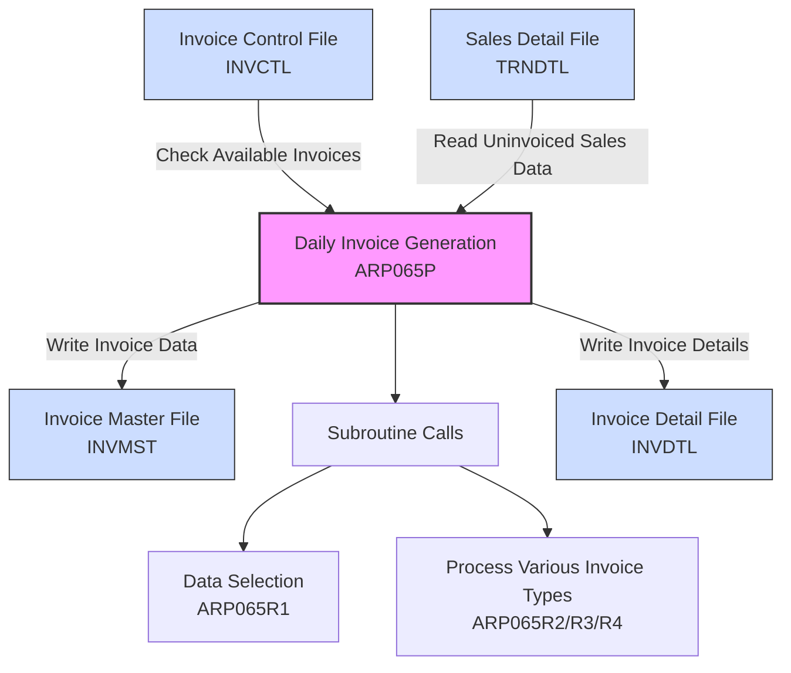
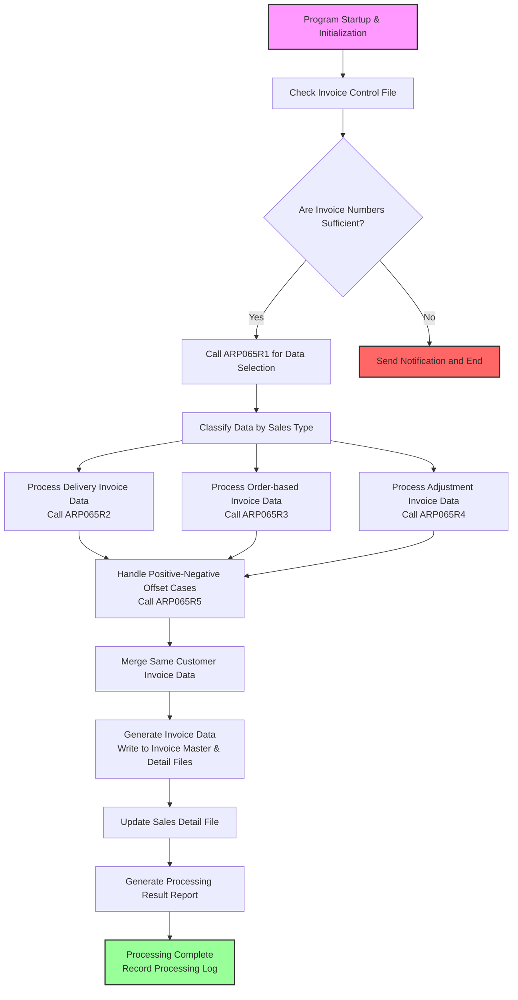
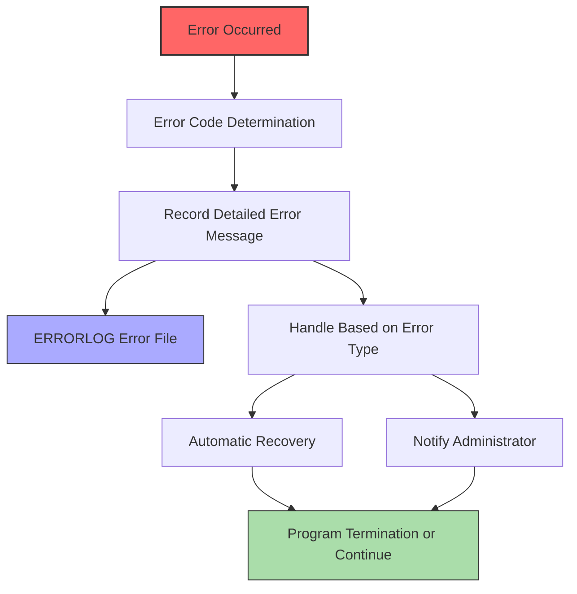

# ARP065P Program Specification

## Basic Information
* **Program ID**: ARP065P
* **Program Name**: Daily Invoice Generation Process
* **Program Type**: CLP (Control Language Program)
* **Last Modified Date**: 1131129
* **Modified By**: S00WCJ

## Program Function Description
This program is a batch control program in the Accounts Receivable system responsible for controlling the execution of daily invoice generation operations. Its main function is to process sales data and batch generate invoices based on specific conditions, ensuring the system can automatically execute daily invoice generation operations, improving operational efficiency and reducing the workload of manual invoice creation.

## File Architecture and Relationship Diagram

### Main File Relationships and Data Flow Description:

1. **Data Reading Process**:
   - ARP065P reads uninvoiced sales data from TRNDTL (Sales Detail File)
   - Performs data filtering and classification through ARP065R1
   - Obtains available invoice numbers and series information from INVCTL (Invoice Control File)

2. **Data Processing Process**:
   - Based on different sales types, calls corresponding subroutines ARP065R2 (Delivery Invoices), ARP065R3 (Order-based Invoices), ARP065R4 (Adjustment Invoices)
   - Handles special cases in sales details such as positive-negative offset cancellation (through ARP065R5)
   - Automatically merges or splits sales data for the same customer based on business rules

3. **Data Writing Process**:
   - Generates invoice data and writes to INVMST (Invoice Master File)
   - Generates invoice detail data and writes to INVDTL (Invoice Detail File)
   - Updates invoice number usage status in INVCTL
   - Updates invoice generation status in TRNDTL sales data

## File List and Field Description

### Main Files Used
1. **Sales Detail File (TRNDTL)**
   - TDCUNO: Customer Number
   - TDSLMN: Salesperson
   - TDACDT: Sales Date
   - TDINTY: Sales Category
   - TDORDS: Order Number
   - TDITEM: Line Item
   - TDAMT: Sales Amount
   - TDQTY: Quantity
   - TDPRC: Unit Price
   - TDMARK: Remarks
   - TDTAX: Tax Category

2. **Invoice Master File (INVMST)**
   - MSINVN: Invoice Number
   - MSSEQN: Sequence Number
   - MSCUNO: Customer Number
   - MSCUNM: Customer Name
   - MSINDT: Invoice Date
   - MSAMT: Invoice Amount
   - MSTAX: Tax Amount
   - MSNET: Net Amount
   - MSSTAT: Status

3. **Invoice Detail File (INVDTL)**
   - DLINVN: Invoice Number
   - DLSEQN: Sequence Number
   - DLITEM: Line Item
   - DLORDS: Order Number
   - DLQTY: Quantity
   - DLPRC: Unit Price
   - DLAMT: Amount
   - DLTAX: Tax Amount

4. **Invoice Control File (INVCTL)**
   - CTINVT: Invoice Type
   - CTPRFX: Series Prefix
   - CTSTART: Starting Number
   - CTEND: Ending Number
   - CTCURN: Current Number

## Input/Output Screen Layout and Description
This program is a batch processing program with no direct screen input/output, mainly executed by system scheduling. Related screen operations are handled by the ARP065RS Daily Invoice Generation screen program.

## Processing Flow Procedure Description

### Visual Processing Flow

1. **Program Initialization**
   - Read system parameters
   - Check invoice generation conditions

2. **Data Selection Processing**
   - Call ARP065R1 to execute invoice generation data selection
   - Select uninvoiced sales details based on sales category and customer conditions

3. **Invoice Generation Processing**
   - Call corresponding processing programs based on different invoice types
   - Delivery Invoice Processing: Call ARP065R2
   - Order-based Invoice Processing: Call ARP065R3
   - Adjustment Invoice Processing: Call ARP065R4

4. **Special Processing**
   - Handle positive-negative offset cancellation in sales details: Call ARP065R5
   - Verify conditions for merging invoices for the same customer

5. **Invoice Number Management**
   - Check invoice series availability
   - Update invoice number usage status

6. **Completion Processing**
   - Update sales details with invoice generation flag
   - Generate processing result report
   - Record processing log

## Subroutine Processing Logic Description
1. **Validation Processing (CHECK_PROC)**
   - Check invoice control file status
   - Verify if invoice numbers are sufficient
   - Handle duplicate execution checks

2. **Error Processing (ERROR_PROC)**
   - Record error messages
   - Send error notifications
   - Handle error recovery mechanisms

## Error Handling Procedures and Message List

### Error Handling Flow

### Error Codes and Handling Methods

| Error Code | Error Message | Cause Description | Handling Method | Prevention Measures |
|------------|---------------|-------------------|-----------------|-------------------|
| **E001** | Invoice control file locked and inaccessible | Another program is simultaneously using or modifying the invoice control file | 1. System automatically waits 30 seconds then retries 2. Send notification after 3 consecutive failures 3. Log error and terminate program | Avoid running multiple programs that access the invoice control file simultaneously |
| **E002** | Insufficient invoice numbers, please contact system administrator | Available invoice numbers have fallen below the system's preset threshold | 1. Record remaining available number count 2. Send notification to system administrator 3. Abort invoice generation process | Regularly check and timely apply for new invoice series numbers |
| **E003** | Incomplete sales data, unable to generate invoice | Key fields in sales details (such as customer number, amount, etc.) are missing data | 1. Record incomplete sales data details 2. Mark this data as abnormal 3. Continue processing other normal data | Strengthen validation mechanisms during sales data input |
| **E004** | Error occurred during invoice generation, please check logs | System error during invoice generation process execution | 1. Record detailed error information and current processing status 2. Rollback processed transactions 3. Preserve failed data for manual processing | Regularly check system resource usage and optimize programs |
| **E005** | Invoice date exceeds legal range | System detected unreasonable invoice date (such as future date or too early date) | 1. Validate sales date reasonableness 2. Record information for dates outside range 3. Use system default date to continue processing | Strengthen date data input validation to avoid illegal dates |
| **E006** | Incomplete customer data, unable to generate invoice | Customer master data missing necessary fields (such as tax ID number) | 1. Record problematic customer list 2. Temporarily skip invoice generation for related customers 3. Notify relevant departments to complete data | Regularly verify customer master file data completeness |
| **E007** | Invoice amount calculation error | Invoice amount, tax amount do not match sales detail totals | 1. Automatically recalculate amounts 2. Record variance information 3. Automatically adjust if variance is within allowable range | Strengthen amount calculation logic, regularly check calculation accuracy |
| **E008** | Network connection abnormal, unable to access related files | System network instability or file server abnormality | 1. Record detailed network connection errors 2. Automatically wait and retry connection 3. Notify network administrator when retry limit reached | Establish backup connection paths, strengthen network monitoring mechanisms |
| **E009** | Program execution timeout | Processing time exceeded preset time limit | 1. Record current execution progress 2. Commit processed data 3. Leave unprocessed data for next execution | Process large amounts of data in batches, optimize program execution efficiency |
| **E010** | Conflict occurred during synchronous processing | Multiple operations simultaneously updating the same data | 1. Record conflicting data 2. Resolve conflicts and protect data integrity 3. Schedule reprocessing | Implement appropriate locking mechanisms to avoid simultaneous modification of the same data |

## Remarks
1. This program is a daily batch operation, generally executed automatically by scheduling
2. If manual execution is needed, it should be executed after daily sales data processing is complete
3. Generated invoice data will be used for subsequent account management and tax reporting
4. To ensure data accuracy, customer master data and order data should be updated before execution
5. Program execution results can be queried through the ARP065RS screen program
6. The 2023 modified version updated the year-month format to 6 digits
7. The system automatically executes at 12:00 AM daily, processing all uninvoiced sales data from the previous day
8. The program automatically generates processing logs, stored in the system log folder for tracking and auditing 