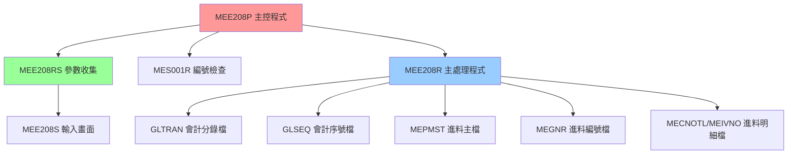
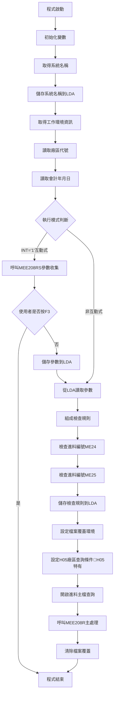

# MEE208P_H05 程式規格書

## 1. 基本資料

| 項目 | 內容 |
|------|------|
| **程式編號** | MEE208P |
| **程式名稱** | 進料會計傳票建立批次主控程式 |
| **程式類型** | CLP (Control Language Program) |
| **廠區** | H05 |
| **系統名稱** | 進料管理系統 (ME) |
| **子系統** | 會計傳票處理 |
| **作者** | S03LYC |
| **建立日期** | 1992/05/26 |
| **檔案位置** | H05CLSRC_THSRC/MEE208P.txt |

### 修改記錄
| 日期 | 版本 | 修改者 | 修改內容 |
|------|------|--------|----------|
| 1992/05/26 | 初版 | S03LYC | 建立進料會計傳票建立系統 |
| 1995/02/07 | 更新 | - | 修改電子進料作業相關科目代號 |
| 2007/03/09 | 更新 | - | GLRLNO 條件調整，簿記條件更新 |

## 2. 程式功能說明

### 主要功能
MEE208P是進料會計傳票建立批次系統的主控制程式，H05廠區版本提供完整的進料傳票產生功能：

1. **參數收集與驗證**：透過互動式介面收集使用者輸入的處理參數
2. **廠區特定處理**：針對H05廠區的特殊業務需求進行處理
3. **編號管理**：檢查和管理進料編號的連續性
4. **主要處理控制**：呼叫實際的傳票產生程式
5. **資料區管理**：維護本地資料區(LDA)的參數資訊
6. **🎯 H05廠區特色**：簡化的處理流程，專注基本進料轉傳票功能

### 業務流程說明
此程式是進料管理與會計系統間的重要橋樑，H05廠區版本專注於標準進料傳票的完整處理流程：

```
進料完成 → 廠區篩選 → 參數設定 → 傳票產生 → 會計入帳
```

### 🎯 系統特色
- **廠區專用過濾**：使用CHAR1='H'進行H05廠區資料篩選
- **簡化處理流程**：移除複雜的A/P系統分流邏輯
- **精確編號控制**：ME24/ME25編號檢查機制
- **標準化輸出**：統一的報表輸出格式

## 3. 檔案架構與關聯圖

### 系統架構圖


### 檔案使用清單
| 檔案名稱 | 使用方式 | 說明 | 廠區差異 |
|----------|----------|------|----------|
| **主要檔案** |
| MEPMST | INPUT | 進料主檔 | H05廠區專用過濾 |
| GLTRAN | UPDATE | 會計分錄檔 | 廠區別命名：GL{廠區}R |
| GLSEQ | UPDATE | 會計序號檔 | 通用 |
| MEGNR | UPDATE | 進料編號檔 | 通用 |
| MECNOTL | UPDATE | 進料明細檔 | 通用 |
| MEIVNO | UPDATE | 進料發票檔 | 通用 |
| **輔助檔案** |
| MEORD | INPUT | 進料訂單檔 | 通用 |
| MERPM | INPUT | 進料退料檔 | 通用 |
| MXVNTR | INPUT | 供應商主檔 | 通用 |
| MERCF | INPUT | 進料收料檔 | 通用 |
| APCKDU | INPUT | 應付票據檔 | 通用 |
| **資料區** |
| *LDA | READ/WRITE | 本地資料區 | 通用 |
| ACCTLDTA{廠區} | READ | 會計主控資料區 | 廠區別：ACCTLDTAH |

### 資料流向說明
1. **輸入流**：LDA參數 → 使用者輸入 → 進料主檔（H05廠區過濾）
2. **處理流**：廠區篩選 → 編號檢查 → 傳票產生
3. **輸出流**：會計分錄 → 報表輸出

## 4. 檔案欄位規格說明

### 🎯 主要資料結構

#### LDA (Local Data Area) 結構分析

##### LDA結構切割視覺化：
```
LDA (1024字元)：[NTNO1|NTNO2|NTNO3|NTNO4|NTNO5|NTNO6|BKNO|YMD|...RULE...|...SNAM...|AREA]
位置:            007    014   021   028   035   042   051  061    101      401       1021
                  ↓     ↓     ↓     ↓     ↓     ↓     ↓    ↓      ↓        ↓         ↓
位置007-013:    [NTNO1]                                                               傳票編號1
位置014-020:          [NTNO2]                                                         傳票編號2  
位置021-027:                [NTNO3]                                                   傳票編號3
位置028-034:                      [NTNO4]                                             傳票編號4
位置035-041:                            [NTNO5]                                       傳票編號5
位置042-048:                                  [NTNO6]                                 傳票編號6
位置051-060:                                        [BKNO____]                        帳冊編號
位置061-068:                                                 [YMD___]                 處理日期
位置101-105:                                                         [RULE_]         檢查規則
位置401-410:                                                                [SNAM____] 系統名稱
位置1021:                                                                           [H] 廠區代號
```

### 🎯 欄位切割技術詳解

#### MEE208RS中的AADS結構欄位切割視覺化

##### 傳票編號切割 (NTNO - 10字元)：
```
NTNO (10字元)：[XX|XXXXXXXX]
                ↓      ↓
NTHD (2字元)： [XX]           傳票類型識別
NTBD (8字元)：   [XXXXXXXX]   傳票編號主體
```

##### 帳冊資訊切割 (BKNO1 - 10字元)：
```
BKNO1 (10字元)：[X|X|XXXXXXXX]
                 ↓ ↓      ↓
TYPE (1字元)：  [X]             帳冊類型
CURR (1字元)：   [X]            幣別代號
ACNO (8字元)：    [XXXXXXXX]    實際帳號
```

##### 日期資訊切割 (DATE - 6字元)：
```
DATE (6字元)：  [XX|XX|XX]
                ↓  ↓  ↓
DATE2 (2字元)： [XX]        年份
DATE1 (4字元)： [XXXX]      年月組合
DATE (6字元)：  [XXXXXX]    完整日期
```

#### H05廠區特有欄位分析

##### CHAR1欄位的業務邏輯（H05特有）：
```
CHAR1 (1字元)：[X]
               ↓
'H'：     H05廠區進料，查詢 CHAR1 *EQ "H"
其他值：   非H05廠區進料，過濾排除
```

#### 詳細DS結構定義
| 欄位名稱 | 位置 | 長度 | 型態 | 說明 |
|---------|------|------|------|------|
| NTNO | 1-10 | 10 | 字元 | 傳票編號，被切割儲存其他資料 |
| NTHD | 1-2 | 2 | 字元 | 切割自NTNO的第1-2位元作為傳票類型 |
| NTBD | 3-10 | 8 | 字元 | 切割自NTNO的第3-10位元作為傳票編號主體 |
| BKNO1 | 11-20 | 10 | 字元 | 帳冊編號，被切割儲存其他資料 |
| TYPE | 11 | 1 | 字元 | 切割自BKNO1的第1位元作為帳冊類型 |
| CURR | 12 | 1 | 字元 | 切割自BKNO1的第2位元作為幣別 |
| ACNO | 13-20 | 8 | 字元 | 切割自BKNO1的第3-10位元作為帳號 |
| DATE | 21-26 | 6 | 字元 | 日期資訊，被切割儲存其他資料 |
| DATE1 | 21-24 | 4 | 字元 | 切割自DATE的第1-4位元作為年月 |
| DATE2 | 21-22 | 2 | 字元 | 切割自DATE的第1-2位元作為年份 |
| CHAR1 | 單獨 | 1 | 字元 | H05特有，廠區識別標記 |

### 🎯 欄位挪用分析

#### CHAR1欄位的廠區識別設計
- **原始設計**：H05廠區增加的廠區識別功能
- **業務挪用**：
  - 'H'：H05廠區進料資料
  - 其他值：非H05廠區進料，被過濾排除
  - **挪用原因**：確保只處理H05廠區的進料資料
  - **業務邏輯**：實現廠區專用的資料篩選機制

#### PMRESV欄位的切割應用
- **資料來源**：從PMRESV欄位的第1位元切割而來（與U01不同）
- **查詢邏輯**：
  - CHAR1='H'時，只處理H05廠區的進料資料
- **技術優勢**：單一欄位實現廠區資料的自動篩選

#### 與U01版本的重要差異
- **切割位置不同**：H05使用PMRESV第1位元，U01使用第2位元
- **業務邏輯不同**：H05進行廠區篩選，U01進行A/P系統分流
- **複雜度差異**：H05邏輯較簡化，專注基本功能

### 欄位定義表格
| 欄位名稱 | 類型 | 長度 | 說明 | 切割方式 | 挪用情況 |
|----------|------|------|------|----------|----------|
| NTNO | CHAR | 10 | 傳票編號 | 2+8切割 | 類型+序號 |
| BKNO1 | CHAR | 10 | 帳冊資訊 | 1+1+8切割 | 類型+幣別+帳號 |
| DATE | CHAR | 6 | 日期資訊 | 2+2+2切割 | 年+月+日 |
| CHAR1 | CHAR | 1 | 廠區識別 | 從PMRESV第1位切割 | H05廠區篩選標記 |

## 5. 輸出/入螢幕布局

### MEE208S 輸入畫面布局

#### 螢幕布局視覺化：
```
+----------------------------------------------------------+
|                APP001S                      公司名稱    日期|
+----------------------------------------------------------+
|             進料加工會計進料傳票建立                      |
+----------------------------------------------------------+
|                                                          |
|                                                          |
| 建立系統：H (P:台灣K:高雄U:天津H:河北)                    |
|                                                          |
| 建立日期：[____/__/__]  (可修改)                         |
|                                                          |
|                                                          |
| 進料帳戶：[__________]  (必填)                           |
|                                                          |
| 傳票範圍：[_______]-[_______]                           |
|           [_______]-[_______]                           |
|           [_______]-[_______]                           |
|                                                          |
|                                                          |
|                                                          |
|                                                          |
| [錯誤訊息顯示區]                                          |
| ENTER:執行    PF03:離開                                  |
+----------------------------------------------------------+
```

### 輸入欄位說明
| 欄位 | 名稱 | 類型 | 長度 | 必填 | 說明 |
|------|------|------|------|------|------|
| YMD | 建立日期 | 8Y0 | 8 | 是 | YYYY/MM/DD格式 |
| BKNO | 進料帳戶 | 10A | 10 | 是 | 帳冊編號 |
| NTNO1-6 | 傳票範圍 | 7Y0 | 7 | 部分 | 三組範圍設定 |

### 與U01版本的畫面差異
- **移除TYPE1欄位**：H05版本沒有A/P系統類型選擇
- **簡化介面**：專注基本的傳票範圍設定
- **廠區固定**：系統自動識別為H05廠區

### 功能鍵定義
- **ENTER**：確認輸入，開始處理
- **PF03**：取消作業，返回主選單

## 6. 處理流程程序說明

### 🎯 主程序邏輯深度分析

#### 整體處理流程圖


#### 🎯 條件判斷詳細邏輯

##### 1. 執行模式判斷
```
IF (&INT *EQ '1') THEN(DO)
```
- **觸發條件**：工作類型為互動式 ('1')
- **處理邏輯**：執行參數收集流程
- **業務意義**：區分互動式執行與批次執行

##### 2. 使用者取消檢查
```
IF (&IN03 *EQ '1') THEN(RETURN)
```
- **觸發條件**：使用者按下F3功能鍵
- **處理邏輯**：立即結束程式
- **業務意義**：提供使用者中斷機制

##### 3. H05廠區查詢條件設定（H05特有）
```
QRYSLT('PMGLDT *EQ ' || &YMD || ' *AND PMCLFG *EQ "1" 
        *AND PMACD *NE "D" *AND CHAR1 *EQ "H"')
MAPFLD((CHAR1 '%SST(PMRESV 1 1)' *CHAR 1))
```
- **H05特有邏輯**：增加CHAR1 *EQ "H"條件
- **廠區篩選**：確保只處理H05廠區的進料資料
- **切割技術**：使用PMRESV第1位元作為廠區識別

### 🎯 子程序邏輯分析

#### MEE208RS 參數收集邏輯
1. **畫面顯示**：展示輸入畫面（移除TYPE1欄位）
2. **欄位驗證**：
   - 日期有效性檢查（使用C018程式）
   - 帳冊存在性驗證
   - 傳票編號邏輯檢查
3. **範圍驗證**：確保起始編號≤結束編號
4. **參數回傳**：將驗證後的參數傳回主程式

#### MES001R 編號檢查邏輯
- **ME24檢查**：進料編號連續性檢查
- **ME25檢查**：進料編號連續性檢查
- **規則組成**：廠區+年+月

#### MEE208R 主處理邏輯
1. **傳票編號產生**：產生會計分錄編號
2. **H05廠區處理**：專門處理H05廠區的進料資料
3. **分錄資料建立**：產生借貸分錄
4. **檔案更新**：更新會計相關檔案
5. **報表產生**：輸出處理報表

### 🎯 特殊邏輯處理

#### H05廠區篩選處理邏輯（H05特有）
- **查詢條件**：CHAR1 *EQ "H"
- **切割來源**：'%SST(PMRESV 1 1)'
- **儲存位置**：查詢中的MAPFLD定義
- **業務用途**：確保只處理H05廠區的進料資料

#### 廠區別處理邏輯
- **會計分錄檔**：動態組成檔案名稱 'GL' + 廠區 + 'R'
- **會計主控資料區**：'ACCTLDTA' + 廠區代號
- **處理差異**：依廠區不同採用不同檔案路徑

#### 系統名稱管理
```
RTVNETA SYSNAME(&SNAM)
CHGDTAARA DTAARA(*LDA (401 10)) VALUE(&SNAM)
```
- **取得系統名稱**：動態取得當前系統名稱
- **儲存位置**：LDA位置401-410
- **業務用途**：系統識別與追蹤

#### 簡化處理流程（H05特色）
- **移除A/P分流**：不需要複雜的A/P系統分類邏輯
- **專注基本功能**：集中處理標準進料轉傳票功能
- **提升處理效率**：減少不必要的條件判斷

## 7. 🎯 數據操作與轉換分析

### 檔案操作詳解

#### READ操作
```
RTVDTAARA DTAARA(*LDA (1021 1)) RTNVAR(&AREA)
```
- **操作目的**：讀取廠區代號
- **數據轉換**：無需轉換，直接使用
- **檢核機制**：無特殊檢核

#### WRITE操作
```
CHGDTAARA DTAARA(*LDA (51 10)) VALUE(&BKNO)
```
- **操作目的**：儲存帳冊編號到LDA
- **數據轉換**：直接儲存字元值
- **H05特點**：簡化的LDA使用模式

### 數據轉換邏輯

#### 數值格式轉換
```
CHGVAR VAR(&NTNO) VALUE(&NTNO1)
```
- **轉換類型**：DEC(7,0) → CHAR(7)
- **轉換目的**：儲存到資料區需要字元格式
- **精度處理**：保持原始精度，無小數位

#### 查詢條件動態組成
```
H05版本：
QRYSLT('PMGLDT *EQ ' || &YMD || ' *AND PMCLFG *EQ "1" 
        *AND PMACD *NE "D" *AND CHAR1 *EQ "H"')
MAPFLD((CHAR1 '%SST(PMRESV 1 1)' *CHAR 1))
```
- **H05特有條件**：增加廠區識別條件
- **欄位對應**：CHAR1 = %SST(PMRESV 1 1)（第1位元）
- **篩選邏輯**：確保只處理H05廠區資料

### 計算邏輯分析

#### 檢查規則組成計算
```
&W#DATE = &AREA + &Y + &M
&W#KIND = 'ME24' / 'ME25'
```
- **計算目的**：組成編號檢查規則
- **組成邏輯**：廠區(1) + 年(4) + 月(2) = 7位
- **業務意義**：確保編號檢查的準確性

### 檢核機制詳解

#### 參數有效性檢查
- **日期檢查**：呼叫C018程式驗證日期格式（與U01的C01不同）
- **帳冊檢查**：查詢BANKAC檔案確認帳冊存在
- **範圍檢查**：確保傳票編號起始≤結束

#### 檔案存取檢核
- **層級檢查**：使用LVLCHK(*NO)略過版本檢查
- **共享設定**：SHARE(*YES)允許多使用者存取

#### H05專用檢核
- **廠區驗證**：確保CHAR1='H'的資料篩選正確
- **切割驗證**：驗證PMRESV第1位元的正確性

## 8. 錯誤處理程序說明

### 錯誤代碼與處理方式清冊

| 錯誤代碼 | 錯誤訊息 | 原因說明 | 處理方式 | 預防措施 |
|----------|---------|---------|---------|----------|
| **IN03='1'** | 使用者取消作業 | 使用者在參數輸入畫面按下F3功能鍵 | 1. 立即結束程式<br>2. 清除暫存資料<br>3. 正常回傳狀態 | 提供清楚的操作說明，避免誤按 |
| **FLAG≠'0'** | 日期格式錯誤 | 輸入的日期不符合YYYY/MM/DD格式或為無效日期 | 1. 顯示錯誤訊息在畫面上<br>2. 欄位標記為錯誤<br>3. 要求重新輸入 | 加強日期輸入的格式檢查與提示 |
| **97** | 帳冊編號不存在 | 在BANKAC檔案中找不到對應的帳冊資料 | 1. 顯示錯誤訊息<br>2. 欄位標記為錯誤<br>3. 提供有效帳冊清單供參考 | 定期更新帳冊主檔，提供帳冊查詢功能 |
| **CHAR1錯誤** | 廠區識別錯誤 | PMRESV第1位元不是'H'，表示非H05廠區資料 | 1. 跳過該筆資料<br>2. 記錄過濾統計<br>3. 繼續處理下一筆 | 確保進料主檔資料的廠區標記正確 |
| **DTAARA錯誤** | 資料區存取失敗 | LDA或會計主控資料區無法正常存取 | 1. 記錄詳細錯誤資訊<br>2. 檢查資料區權限<br>3. 通知系統管理員 | 確保程式執行者具備適當的資料區存取權限 |
| **檔案鎖定** | 檔案被其他程式使用中 | MEPMST或相關檔案被其他程式鎖定 | 1. 等待30秒後重試<br>2. 連續3次失敗後通知使用者<br>3. 建議稍後再試 | 避免同時執行多個相關程式 |
| **編號範圍錯誤** | 傳票編號範圍設定錯誤 | 起始編號大於結束編號或編號為0 | 1. 顯示具體錯誤內容<br>2. 標記相關欄位<br>3. 提供正確設定範例 | 在輸入時即時檢查編號邏輯性 |

### 處理方式說明

#### 使用者取消處理
```
IF (&IN03 *EQ '1') THEN(RETURN)
```
- **處理邏輯**：立即結束程式
- **清理作業**：無需特殊清理
- **回傳狀態**：正常結束

#### 廠區篩選錯誤處理（H05特有）
- **篩選邏輯**：CHAR1 *EQ "H"自動過濾非H05資料
- **錯誤記錄**：無需特殊錯誤處理，正常篩選邏輯
- **統計回饋**：在報表中顯示處理筆數統計

#### 檔案錯誤處理
- **策略**：使用LVLCHK(*NO)容錯機制
- **恢復**：檔案覆蓋確保環境正確
- **記錄**：無特殊錯誤記錄機制

#### 日期檢查程式差異
- **H05版本**：使用'C018'程式進行日期檢查
- **U01版本**：使用'C01'程式進行日期檢查
- **處理邏輯**：相同的錯誤處理流程

## 9. 🎯 特殊技術實現說明

### 廠區篩選技術

#### 動態廠區識別技術
```
H05廠區篩選條件：
QRYSLT('PMGLDT *EQ ' || &YMD || ' *AND PMCLFG *EQ "1" 
        *AND PMACD *NE "D" *AND CHAR1 *EQ "H"')
MAPFLD((CHAR1 '%SST(PMRESV 1 1)' *CHAR 1))
```
- **技術特色**：使用PMRESV第1位元進行廠區識別
- **實現方式**：透過MAPFLD動態擷取欄位片段
- **系統效益**：確保資料處理的廠區專用性

#### 欄位切割技術差異
```
MAPFLD((CHAR1 '%SST(PMRESV 1 1)' *CHAR 1))  // H05版本
MAPFLD((PMRES1 '%SST(PMRESV 2 1)' *CHAR 1)) // U01版本
```
- **技術差異**：H05使用第1位元，U01使用第2位元
- **切割目的**：H05進行廠區識別，U01進行A/P分流
- **業務應用**：不同的業務邏輯需求

### 記憶體優化技術

#### 變數重複使用
```
CHGVAR VAR(&NTNO) VALUE(&NTNO1)
CHGDTAARA DTAARA(*LDA (7 07)) VALUE(&NTNO)
CHGVAR VAR(&NTNO) VALUE(&NTNO2)
CHGDTAARA DTAARA(*LDA (14 07)) VALUE(&NTNO)
```
- **優化技巧**：使用單一&NTNO變數重複轉換不同傳票編號
- **記憶體節省**：避免宣告多個轉換變數
- **效能影響**：微幅提升記憶體使用效率

#### 系統名稱管理技術
```
RTVNETA SYSNAME(&SNAM)
CHGDTAARA DTAARA(*LDA (401 10)) VALUE(&SNAM)
```
- **動態取得**：即時取得當前執行系統名稱
- **追蹤機制**：建立系統執行來源的追蹤記錄
- **故障排除**：便於問題發生時的系統定位

### 程式碼優化技巧

#### 簡化處理邏輯
- **移除複雜分流**：H05版本不需要A/P系統分流邏輯
- **專注核心功能**：集中處理基本的進料轉傳票功能
- **提升維護性**：減少條件判斷，降低維護複雜度

#### 條件執行優化
```
註解化的SBMJOB段落：
/* SBMJOB JOB(MEE208P) JOBD(MTJOBD) OUTQ(&OUTQ) + */
/* RQSDTA('CALL MEE208P') */
/* RETURN */
```
- **設計考量**：保留批次提交功能但暫不使用
- **彈性設計**：需要時可快速啟用批次模式
- **維護友善**：註解保留歷史功能參考

#### 報表格式最佳化
```
OVRPRTF FILE(QPRINT) PAGESIZE(*N 132) CPI(10)
OVRPRTF FILE(QPRINT1) PAGESIZE(*N 132) CPI(10)
```
- **格式統一**：132欄寬度，10 CPI字型
- **輸出最佳化**：適合H05廠區的報表需求
- **列印友善**：標準化的列印格式

## 10. 🎯 跨廠區版本分析

### 版本分布情況
| 廠區 | 程式版本 | 存在狀態 | 特殊功能 | 廠區篩選 |
|------|----------|----------|----------|----------|
| **U01** | 完整版 | ✅存在 | A/P系統整合 | ❌無廠區篩選 |
| **H05** | 標準版 | ✅存在 | 廠區專用篩選 | ✅CHAR1='H' |
| **K02** | - | ❌不存在 | - | - |
| **P02** | - | ❌不存在 | - | - |

### 程式碼差異分析

#### H05 vs U01 主要差異

##### 1. 參數傳遞差異
**H05版本（基本功能）**：
```
CALL PGM(MEE208RS) PARM(&IN03 &YMD &ACYMD &BKNO +
     &NTNO1 &NTNO2 &NTNO3 &NTNO4 &NTNO5 &NTNO6)
```

**U01版本（支援A/P系統）**：
```
CALL PGM(MEE208RS) PARM(&IN03 &YMD &ACYMD &BKNO +
     &NTNO1 &NTNO2 &NTNO3 &NTNO4 &NTNO5 &NTNO6 &TYPE1)
```

##### 2. 查詢條件設定差異
**H05版本（廠區篩選）**：
```
QRYSLT('PMGLDT *EQ ' || &YMD || ' *AND PMCLFG *EQ "1" 
        *AND PMACD *NE "D" *AND CHAR1 *EQ "H"')
MAPFLD((CHAR1 '%SST(PMRESV 1 1)' *CHAR 1))
```

**U01版本（A/P系統分流）**：
```
/* 一般進料 */
IF (&TYPE1 *EQ ' ') THEN(DO)
  QRYSLT('PMRES1 *NE "1"')
ENDDO
/* A/P系統進料 */
IF (&TYPE1 *EQ '1') THEN(DO)
  QRYSLT('PMRES1 *EQ "1"')
ENDDO
```

##### 3. LDA使用差異
**H05版本（簡化LDA）**：
```
無TYPE1相關處理
```

**U01版本（增加TYPE1儲存）**：
```
CHGDTAARA DTAARA(*LDA (106 1)) VALUE(&TYPE1)
```

##### 4. 日期檢查程式差異
**H05版本**：
```
CALL 'C018'  // 使用C018進行日期檢查
```

**U01版本**：
```
CALL PGM1    // 使用C01進行日期檢查（透過PGM1變數）
```

##### 5. 欄位切割位置差異
**H05版本**：
```
MAPFLD((CHAR1 '%SST(PMRESV 1 1)' *CHAR 1))  // 第1位元
```

**U01版本**：
```
MAPFLD((PMRES1 '%SST(PMRESV 2 1)' *CHAR 1)) // 第2位元
```

### 功能差異說明

#### H05廠區特點
1. **廠區專用篩選**：
   - **業務需求**：H05廠區需要處理專屬的進料資料
   - **實現方式**：透過CHAR1='H'進行廠區資料篩選
   - **處理邏輯**：只處理PMRESV第1位元為'H'的進料資料

2. **簡化處理流程**：
   - **業務需求**：H05廠區業務相對簡單，不需要A/P系統分流
   - **實現方式**：使用標準的進料處理流程
   - **處理重點**：專注於基本的進料轉傳票功能

3. **標準化報表格式**：
   - **輸出格式**：132欄寬度，10 CPI字型
   - **報表類型**：標準化的進料代列和憑記代列
   - **業務優勢**：符合H05廠區的報表需求

#### U01廠區特點
1. **A/P系統整合**：
   - **業務需求**：U01廠區需要與應付帳款系統緊密整合
   - **實現方式**：透過TYPE1參數區分進料來源
   - **處理邏輯**：分別處理A/P系統進料與一般進料

2. **進料分流管理**：
   - **TYPE1=' '**：處理一般進料，查詢PMRES1 *NE "1"
   - **TYPE1='1'**：處理A/P系統進料，查詢PMRES1 *EQ "1"
   - **業務優勢**：避免不同系統進料的混淆

### 調用關係差異

#### 子程式調用鏈
**H05版本調用順序**：
```
MEE208P → MEE208RS (基本參數收集)
       → MES001R (編號檢查)
       → MEE208R (廠區篩選主處理)
```

**U01版本調用順序**：
```
MEE208P → MEE208RS (參數收集+TYPE1)
       → MES001R (編號檢查)
       → MEE208R (主處理+A/P分流)
```

### 系統整合差異

#### 廠區特定需求分析
1. **H05廠區**：
   - 廠區專用資料處理需求
   - 簡化的業務流程
   - 標準化的報表輸出
   - 注重處理效率

2. **U01廠區**：
   - A/P系統整合需求較高
   - 進料來源較複雜
   - 需要精確的分流管理
   - 系統追蹤要求較嚴格

#### 版本選擇策略
- **H05策略**：採用廠區專用版本，專注廠區資料篩選
- **U01策略**：採用功能完整版本，支援A/P系統整合
- **技術考量**：根據廠區業務特性選擇適合的版本

### 跨廠區擴展建議

#### 技術層面建議
1. **標準化廠區識別機制**：
   - 評估其他廠區對廠區專用篩選的需求
   - 建立統一的CHAR1參數標準
   - 制定標準的PMRESV欄位使用規範

2. **處理邏輯統一化**：
   - 考慮將H05的廠區篩選邏輯推廣到其他廠區
   - 建立統一的廠區資料處理機制
   - 提升整體系統的一致性

3. **版本融合可能性**：
   - 評估H05廠區篩選與U01 A/P分流的融合可能
   - 建立同時支援廠區篩選和A/P分流的統一版本
   - 確保融合過程的相容性

## 11. 備註

### 特殊注意事項

1. **廠區篩選重要性**：
   - CHAR1='H'條件的正確設定會影響資料處理範圍
   - 建議定期檢查PMRESV第1位元的資料正確性
   - 確保只處理H05廠區的進料資料

2. **廠區環境設定**：
   - 確保LDA中廠區代號設定為'H'
   - 檢查會計主控資料區ACCTLDTAH存在性
   - 驗證進料主檔(MEPMST)中H05廠區資料完整性

3. **執行順序重要性**：
   - 必須先執行互動式參數收集
   - 再執行批次處理流程
   - 不可跳過編號檢查步驟

### 技術債務

1. **程式架構**：
   - CLP與RPG混合架構較複雜
   - 廠區篩選邏輯集中在查詢條件中
   - 建議未來統一為單一語言架構

2. **錯誤處理**：
   - 缺乏詳細的廠區篩選錯誤記錄機制
   - CHAR1驗證邏輯較簡單
   - 建議加入標準化錯誤處理

3. **文檔維護**：
   - 程式內註解多為中文，需要英文化
   - 廠區篩選相關邏輯缺乏詳細說明
   - 建議建立完整的廠區識別文檔

### 改善建議

1. **短期改善**：
   - 考慮是否需要將U01的A/P系統功能引入H05
   - 統一廠區識別機制
   - 建立廠區篩選操作手冊

2. **長期規劃**：
   - 考慮重構為現代化架構
   - 整合到ERP系統框架
   - 建立自動化測試機制

### 跨廠區整合建議

1. **功能標準化**：
   - 評估是否需要將H05的廠區篩選功能推廣至其他廠區
   - 統一CHAR1參數的使用標準
   - 建立共同的廠區識別邏輯

2. **技術整合**：
   - 建立統一的廠區參數配置
   - 統一檔案命名規則
   - 建立跨廠區資料交換機制

3. **版本管理**：
   - 建立統一的版本更新策略
   - 考慮各廠區的特殊需求
   - 保持向下相容性

### 廠區篩選機制維護

1. **業務邏輯維護**：
   - 定期檢查PMRESV第1位元的資料正確性
   - 確保H05廠區資料的正確標記
   - 建立廠區篩選結果的驗證機制

2. **系統整合維護**：
   - 定期檢查廠區篩選條件的正確性
   - 確保CHAR1參數的正確使用
   - 監控廠區篩選處理的效能

3. **使用者訓練**：
   - 建立廠區專用處理的使用指引
   - 提供H05廠區進料的操作訓練
   - 建立常見問題的解決手冊

### H05廠區特色總結

1. **專業化處理**：
   - 專門處理H05廠區的進料資料
   - 簡化的業務流程設計
   - 高效的資料篩選機制

2. **技術創新**：
   - 使用PMRESV第1位元進行廠區識別
   - MAPFLD技術的巧妙應用
   - 標準化的報表輸出格式

3. **維護便利性**：
   - 減少複雜的條件判斷
   - 專注核心業務功能
   - 降低系統維護複雜度

---
**文件版本**: 1.0  
**製作日期**: 2024年12月26日  
**製作者**: Claude AI  
**審核狀態**: 待審核  
**遵循標準**: 東鋼程式規格書建立計畫書模板 