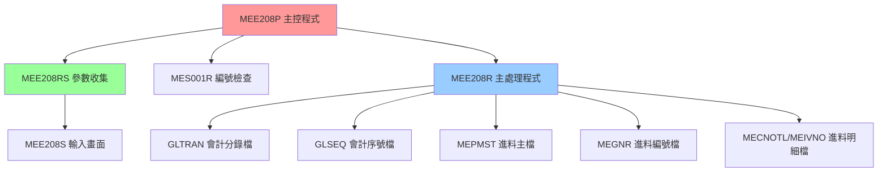
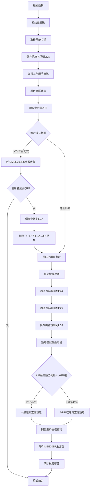

# MEE208P_U01 程式規格書

## 1. 基本資料

| 項目 | 內容 |
|------|------|
| **程式編號** | MEE208P |
| **程式名稱** | 進料會計傳票建立批次主控程式 |
| **程式類型** | CLP (Control Language Program) |
| **廠區** | U01 |
| **系統名稱** | 進料管理系統 (ME) |
| **子系統** | 會計傳票處理 |
| **作者** | S03LYC |
| **建立日期** | 1992/05/26 |
| **檔案位置** | U01CLSRC_THSRC/MEE208P.txt |

### 修改記錄
| 日期 | 版本 | 修改者 | 修改內容 |
|------|------|--------|----------|
| 1992/05/26 | 初版 | S03LYC | 建立進料會計傳票建立系統 |
| 1995/02/07 | 更新 | - | 修改電子進料作業相關科目代號 |

## 2. 程式功能說明

### 主要功能
MEE208P是進料會計傳票建立批次系統的主控制程式，U01廠區版本提供完整的進料傳票產生功能：

1. **參數收集與驗證**：透過互動式介面收集使用者輸入的處理參數
2. **A/P系統整合**：支援應付帳款系統與一般進料的區分處理
3. **編號管理**：檢查和管理進料編號的連續性
4. **主要處理控制**：呼叫實際的傳票產生程式
5. **資料區管理**：維護本地資料區(LDA)的參數資訊
6. **🎯 U01廠區特色**：支援A/P系統分類處理，提供更精確的進料管控

### 業務流程說明
此程式是進料管理與會計系統間的重要橋樑，U01廠區版本專注於進料傳票的完整處理流程：

```
進料完成 → 系統分類 → 參數設定 → 傳票產生 → 會計入帳
```

### 🎯 系統特色
- **A/P系統整合**：區分應付帳款系統進料與一般進料
- **精確編號控制**：ME24/ME25編號檢查機制
- **動態查詢條件**：依據A/P系統類型調整查詢邏輯

## 3. 檔案架構與關聯圖

### 系統架構圖


### 檔案使用清單
| 檔案名稱 | 使用方式 | 說明 | 廠區差異 |
|----------|----------|------|----------|
| **主要檔案** |
| MEPMST | INPUT | 進料主檔 | 通用 |
| GLTRAN | UPDATE | 會計分錄檔 | 廠區別命名：GL{廠區}R |
| GLSEQ | UPDATE | 會計序號檔 | 通用 |
| MEGNR | UPDATE | 進料編號檔 | 通用 |
| MECNOTL | UPDATE | 進料明細檔 | 通用 |
| MEIVNO | UPDATE | 進料發票檔 | 通用 |
| **輔助檔案** |
| MEORD | INPUT | 進料訂單檔 | 通用 |
| MERPM | INPUT | 進料退料檔 | 通用 |
| MXVNTR | INPUT | 供應商主檔 | 通用 |
| MERCF | INPUT | 進料收料檔 | 通用 |
| APCKDU | INPUT | 應付票據檔 | 通用 |
| **資料區** |
| *LDA | READ/WRITE | 本地資料區 | 通用 |
| ACCTLDTA{廠區} | READ | 會計主控資料區 | 廠區別：ACCTLDTAU |

### 資料流向說明
1. **輸入流**：LDA參數 → 使用者輸入 → 進料主檔
2. **處理流**：A/P分類 → 編號檢查 → 傳票產生
3. **輸出流**：會計分錄 → 報表輸出

## 4. 檔案欄位規格說明

### 🎯 主要資料結構

#### LDA (Local Data Area) 結構分析

##### LDA結構切割視覺化：
```
LDA (1024字元)：[NTNO1|NTNO2|NTNO3|NTNO4|NTNO5|NTNO6|BKNO|YMD|...RULE...|TYPE1|...SNAM...|AREA]
位置:            007    014   021   028   035   042   051  061    101    106    401       1021
                  ↓     ↓     ↓     ↓     ↓     ↓     ↓    ↓      ↓      ↓      ↓         ↓
位置007-013:    [NTNO1]                                                                     傳票編號1
位置014-020:          [NTNO2]                                                               傳票編號2  
位置021-027:                [NTNO3]                                                         傳票編號3
位置028-034:                      [NTNO4]                                                   傳票編號4
位置035-041:                            [NTNO5]                                             傳票編號5
位置042-048:                                  [NTNO6]                                       傳票編號6
位置051-060:                                        [BKNO____]                              帳冊編號
位置061-068:                                                 [YMD___]                       處理日期
位置101-105:                                                         [RULE_]               檢查規則
位置106:                                                                   [T]⭐U01特有     A/P系統類型
位置401-410:                                                                    [SNAM____] 系統名稱
位置1021:                                                                                 [U] 廠區代號
```

### 🎯 欄位切割技術詳解

#### MEE208RS中的AADS結構欄位切割視覺化

##### 傳票編號切割 (NTNO - 10字元)：
```
NTNO (10字元)：[XX|XXXXXXXX]
                ↓      ↓
NTHD (2字元)： [XX]           傳票類型識別
NTBD (8字元)：   [XXXXXXXX]   傳票編號主體
```

##### 帳冊資訊切割 (BKNO1 - 10字元)：
```
BKNO1 (10字元)：[X|X|XXXXXXXX]
                 ↓ ↓      ↓
TYPE (1字元)：  [X]             帳冊類型
CURR (1字元)：   [X]            幣別代號
ACNO (8字元)：    [XXXXXXXX]    實際帳號
```

##### 日期資訊切割 (DATE - 6字元)：
```
DATE (6字元)：  [XX|XX|XX]
                ↓  ↓  ↓
DATE2 (2字元)： [XX]        年份
DATE1 (4字元)： [XXXX]      年月組合
DATE (6字元)：  [XXXXXX]    完整日期
```

#### U01廠區特有欄位分析

##### TYPE1欄位的業務邏輯：
```
TYPE1 (1字元)：[X]
               ↓
' ' (空值)：一般進料，查詢 PMRES1 *NE "1"
'1'：     A/P系統進料，查詢 PMRES1 *EQ "1"
```

#### 詳細DS結構定義
| 欄位名稱 | 位置 | 長度 | 型態 | 說明 |
|---------|------|------|------|------|
| NTNO | 1-10 | 10 | 字元 | 傳票編號，被切割儲存其他資料 |
| NTHD | 1-2 | 2 | 字元 | 切割自NTNO的第1-2位元作為傳票類型 |
| NTBD | 3-10 | 8 | 字元 | 切割自NTNO的第3-10位元作為傳票編號主體 |
| BKNO1 | 11-20 | 10 | 字元 | 帳冊編號，被切割儲存其他資料 |
| TYPE | 11 | 1 | 字元 | 切割自BKNO1的第1位元作為帳冊類型 |
| CURR | 12 | 1 | 字元 | 切割自BKNO1的第2位元作為幣別 |
| ACNO | 13-20 | 8 | 字元 | 切割自BKNO1的第3-10位元作為帳號 |
| DATE | 21-26 | 6 | 字元 | 日期資訊，被切割儲存其他資料 |
| DATE1 | 21-24 | 4 | 字元 | 切割自DATE的第1-4位元作為年月 |
| DATE2 | 21-22 | 2 | 字元 | 切割自DATE的第1-2位元作為年份 |
| TYPE1 | 單獨 | 1 | 字元 | U01特有，A/P系統分類標記 |

### 🎯 欄位挪用分析

#### TYPE1欄位的創新設計
- **原始設計**：U01廠區增加的A/P系統分類功能
- **業務挪用**：
  - 空值：一般進料系統
  - '1'：應付帳款系統進料
  - **挪用原因**：區分不同進料來源，提供精確的會計處理
  - **業務邏輯**：便於A/P系統與一般進料的分流管理

#### PMRES1欄位的巧妙應用
- **資料來源**：從PMRESV欄位的第2位元切割而來
- **查詢邏輯**：
  - TYPE1=' '時，查詢PMRES1 *NE "1" (非A/P系統進料)
  - TYPE1='1'時，查詢PMRES1 *EQ "1" (A/P系統進料)
- **技術優勢**：單一欄位控制兩種不同的業務邏輯

### 欄位定義表格
| 欄位名稱 | 類型 | 長度 | 說明 | 切割方式 | 挪用情況 |
|----------|------|------|------|----------|----------|
| NTNO | CHAR | 10 | 傳票編號 | 2+8切割 | 類型+序號 |
| BKNO1 | CHAR | 10 | 帳冊資訊 | 1+1+8切割 | 類型+幣別+帳號 |
| DATE | CHAR | 6 | 日期資訊 | 2+2+2切割 | 年+月+日 |
| TYPE1 | CHAR | 1 | A/P分類 | 無切割 | U01特有功能 |
| PMRES1 | CHAR | 1 | 進料分類 | 從PMRESV切割 | 系統分流標記 |

## 5. 輸出/入螢幕布局

### MEE208S 輸入畫面布局

#### 螢幕布局視覺化：
```
+----------------------------------------------------------+
|                APP001S                      公司名稱    日期|
+----------------------------------------------------------+
|             進料加工會計進料傳票建立                      |
+----------------------------------------------------------+
|                                                          |
|                                                          |
| 建立系統：U (P:台灣K:高雄U:天津H:河北)                    |
|                                                          |
| 建立日期：[____/__/__]  (可修改)                         |
|                                                          |
| 進料類型：[X]  (1:A/P系統，" ":特殊)                     |
|          **(1:A/P系統進料; " ":特殊)                     |
|                                                          |
| 進料帳戶：[__________]  (必填)                           |
|                                                          |
| 傳票範圍：[_______]-[_______]                           |
|           [_______]-[_______]                           |
|           [_______]-[_______]                           |
|                                                          |
|                                                          |
|                                                          |
|                                                          |
| [錯誤訊息顯示區]                                          |
| ENTER:執行    PF03:離開                                  |
+----------------------------------------------------------+
```

### 輸入欄位說明
| 欄位 | 名稱 | 類型 | 長度 | 必填 | 說明 |
|------|------|------|------|------|------|
| YMD | 建立日期 | 8Y0 | 8 | 是 | YYYY/MM/DD格式 |
| TYPE1 | 進料類型 | 1A | 1 | 選填 | '1':A/P系統，' ':一般進料 |
| BKNO | 進料帳戶 | 10A | 10 | 是 | 帳冊編號 |
| NTNO1-6 | 傳票範圍 | 7Y0 | 7 | 部分 | 三組範圍設定 |

### 功能鍵定義
- **ENTER**：確認輸入，開始處理
- **PF03**：取消作業，返回主選單

## 6. 處理流程程序說明

### 🎯 主程序邏輯深度分析

#### 整體處理流程圖


#### 🎯 條件判斷詳細邏輯

##### 1. 執行模式判斷
```
IF (&INT *EQ '1') THEN(DO)
```
- **觸發條件**：工作類型為互動式 ('1')
- **處理邏輯**：執行參數收集流程
- **業務意義**：區分互動式執行與批次執行

##### 2. 使用者取消檢查
```
IF (&IN03 *EQ '1') THEN(RETURN)
```
- **觸發條件**：使用者按下F3功能鍵
- **處理邏輯**：立即結束程式
- **業務意義**：提供使用者中斷機制

##### 3. A/P系統類型判斷（U01特有）
```
IF (&TYPE1 *EQ ' ') THEN(DO)
  一般進料：PMRES1 *NE "1"
ENDDO
IF (&TYPE1 *EQ '1') THEN(DO)
  A/P系統進料：PMRES1 *EQ "1"
ENDDO
```

### 🎯 子程序邏輯分析

#### MEE208RS 參數收集邏輯
1. **畫面顯示**：展示輸入畫面（包含TYPE1欄位）
2. **欄位驗證**：
   - 日期有效性檢查
   - 帳冊存在性驗證
   - 傳票編號邏輯檢查
   - TYPE1值驗證
3. **範圍驗證**：確保起始編號≤結束編號
4. **參數回傳**：將驗證後的參數傳回主程式

#### MES001R 編號檢查邏輯
- **ME24檢查**：進料編號連續性檢查
- **ME25檢查**：進料編號連續性檢查
- **規則組成**：廠區+年+月

#### MEE208R 主處理邏輯
1. **傳票編號產生**：產生會計分錄編號
2. **A/P分類處理**：依據TYPE1進行不同的處理邏輯
3. **分錄資料建立**：產生借貸分錄
4. **檔案更新**：更新會計相關檔案
5. **報表產生**：輸出處理報表

### 🎯 特殊邏輯處理

#### A/P系統分類處理邏輯（U01特有）
- **查詢條件差異**：
  - 一般進料：PMRES1 *NE "1"
  - A/P系統：PMRES1 *EQ "1"
- **儲存位置**：LDA位置106
- **業務用途**：支援不同進料來源的分流處理

#### 廠區別處理邏輯
- **會計分錄檔**：動態組成檔案名稱 'GL' + 廠區 + 'R'
- **會計主控資料區**：'ACCTLDTA' + 廠區代號
- **處理差異**：依廠區不同採用不同檔案路徑

#### 系統名稱管理
```
RTVNETA SYSNAME(&SNAM)
CHGDTAARA DTAARA(*LDA (401 10)) VALUE(&SNAM)
```
- **取得系統名稱**：動態取得當前系統名稱
- **儲存位置**：LDA位置401-410
- **業務用途**：系統識別與追蹤

## 7. 🎯 數據操作與轉換分析

### 檔案操作詳解

#### READ操作
```
RTVDTAARA DTAARA(*LDA (1021 1)) RTNVAR(&AREA)
```
- **操作目的**：讀取廠區代號
- **數據轉換**：無需轉換，直接使用
- **檢核機制**：無特殊檢核

#### WRITE操作
```
CHGDTAARA DTAARA(*LDA (106 1)) VALUE(&TYPE1)
```
- **操作目的**：儲存A/P系統類型到LDA
- **數據轉換**：直接儲存字元值
- **U01特有**：此功能僅在U01廠區存在

### 數據轉換邏輯

#### 數值格式轉換
```
CHGVAR VAR(&NTNO) VALUE(&NTNO1)
```
- **轉換類型**：DEC(7,0) → CHAR(7)
- **轉換目的**：儲存到資料區需要字元格式
- **精度處理**：保持原始精度，無小數位

#### 查詢條件動態組成
```
U01版本：
QRYSLT('PMGLDT *EQ ' || &YMD || ' *AND PMCLFG *EQ "1" 
        *AND PMRES1 *NE "1" *AND PMACD *NE "D"')  // 一般進料
QRYSLT('PMGLDT *EQ ' || &YMD || ' *AND PMCLFG *EQ "1" 
        *AND PMRES1 *EQ "1" *AND PMACD *NE "D"')  // A/P系統
```
- **動態條件**：依據TYPE1值組成不同查詢條件
- **欄位對應**：PMRES1 = %SST(PMRESV 2 1)

### 計算邏輯分析

#### 檢查規則組成計算
```
&W#DATE = &AREA + &Y + &M
&W#KIND = 'ME24' / 'ME25'
```
- **計算目的**：組成編號檢查規則
- **組成邏輯**：廠區(1) + 年(4) + 月(2) = 7位
- **業務意義**：確保編號檢查的準確性

### 檢核機制詳解

#### 參數有效性檢查
- **日期檢查**：呼叫C01程式驗證日期格式
- **帳冊檢查**：查詢BANKAC檔案確認帳冊存在
- **範圍檢查**：確保傳票編號起始≤結束
- **TYPE1檢查**：驗證A/P系統類型值的正確性

#### 檔案存取檢核
- **層級檢查**：使用LVLCHK(*NO)略過版本檢查
- **共享設定**：SHARE(*YES)允許多使用者存取

## 8. 錯誤處理程序說明

### 錯誤代碼與處理方式清冊

| 錯誤代碼 | 錯誤訊息 | 原因說明 | 處理方式 | 預防措施 |
|----------|---------|---------|---------|----------|
| **IN03='1'** | 使用者取消作業 | 使用者在參數輸入畫面按下F3功能鍵 | 1. 立即結束程式<br>2. 清除暫存資料<br>3. 正常回傳狀態 | 提供清楚的操作說明，避免誤按 |
| **FLAG≠'0'** | 日期格式錯誤 | 輸入的日期不符合YYYY/MM/DD格式或為無效日期 | 1. 顯示錯誤訊息在畫面上<br>2. 欄位標記為錯誤<br>3. 要求重新輸入 | 加強日期輸入的格式檢查與提示 |
| **97** | 帳冊編號不存在 | 在BANKAC檔案中找不到對應的帳冊資料 | 1. 顯示錯誤訊息<br>2. 欄位標記為錯誤<br>3. 提供有效帳冊清單供參考 | 定期更新帳冊主檔，提供帳冊查詢功能 |
| **TYPE1錯誤** | A/P系統類型設定錯誤 | TYPE1欄位輸入了無效值（非'1'或空值） | 1. 顯示具體錯誤內容<br>2. 說明正確的輸入值<br>3. 要求重新輸入 | 在畫面上提供清楚的選項說明 |
| **DTAARA錯誤** | 資料區存取失敗 | LDA或會計主控資料區無法正常存取 | 1. 記錄詳細錯誤資訊<br>2. 檢查資料區權限<br>3. 通知系統管理員 | 確保程式執行者具備適當的資料區存取權限 |
| **檔案鎖定** | 檔案被其他程式使用中 | MEPMST或相關檔案被其他程式鎖定 | 1. 等待30秒後重試<br>2. 連續3次失敗後通知使用者<br>3. 建議稍後再試 | 避免同時執行多個相關程式 |
| **編號範圍錯誤** | 傳票編號範圍設定錯誤 | 起始編號大於結束編號或編號為0 | 1. 顯示具體錯誤內容<br>2. 標記相關欄位<br>3. 提供正確設定範例 | 在輸入時即時檢查編號邏輯性 |

### 處理方式說明

#### 使用者取消處理
```
IF (&IN03 *EQ '1') THEN(RETURN)
```
- **處理邏輯**：立即結束程式
- **清理作業**：無需特殊清理
- **回傳狀態**：正常結束

#### A/P系統類型驗證（U01特有）
- **有效值檢查**：確保TYPE1只能是'1'或空值
- **業務邏輯驗證**：檢查與進料類型的一致性
- **錯誤回饋**：提供明確的修正指引

#### 檔案錯誤處理
- **策略**：使用LVLCHK(*NO)容錯機制
- **恢復**：檔案覆蓋確保環境正確
- **記錄**：無特殊錯誤記錄機制

## 9. 🎯 特殊技術實現說明

### A/P系統整合技術

#### 動態查詢條件技術
```
一般進料查詢條件：
QRYSLT('PMGLDT *EQ ' || &YMD || ' *AND PMCLFG *EQ "1" 
        *AND PMRES1 *NE "1" *AND PMACD *NE "D"')

A/P系統查詢條件：
QRYSLT('PMGLDT *EQ ' || &YMD || ' *AND PMCLFG *EQ "1" 
        *AND PMRES1 *EQ "1" *AND PMACD *NE "D"')
```
- **技術特色**：單一程式支援兩種業務模式
- **實現方式**：依據TYPE1值動態調整查詢條件
- **系統效益**：避免程式重複，提升維護效率

#### 欄位對應技術
```
MAPFLD((PMRES1 '%SST(PMRESV 2 1)' *CHAR 1))
```
- **技術創新**：使用MAPFLD動態擷取欄位片段
- **資料來源**：從PMRESV第2位元擷取A/P系統標記
- **業務應用**：實現A/P系統與一般進料的自動分流

### 記憶體優化技術

#### 變數重複使用
```
CHGVAR VAR(&NTNO) VALUE(&NTNO1)
CHGDTAARA DTAARA(*LDA (7 07)) VALUE(&NTNO)
CHGVAR VAR(&NTNO) VALUE(&NTNO2)
CHGDTAARA DTAARA(*LDA (14 07)) VALUE(&NTNO)
```
- **優化技巧**：使用單一&NTNO變數重複轉換不同傳票編號
- **記憶體節省**：避免宣告多個轉換變數
- **效能影響**：微幅提升記憶體使用效率

#### 系統名稱管理技術
```
RTVNETA SYSNAME(&SNAM)
CHGDTAARA DTAARA(*LDA (401 10)) VALUE(&SNAM)
```
- **動態取得**：即時取得當前執行系統名稱
- **追蹤機制**：建立系統執行來源的追蹤記錄
- **故障排除**：便於問題發生時的系統定位

### 程式碼優化技巧

#### 條件執行優化
```
註解化的SBMJOB段落：
/* SBMJOB JOB(MEE208P) JOBD(MTJOBD) OUTQ(&OUTQ) + */
/* RQSDTA('CALL MEE208P') */
/* RETURN */
```
- **設計考量**：保留批次提交功能但暫不使用
- **彈性設計**：需要時可快速啟用批次模式
- **維護友善**：註解保留歷史功能參考

#### 向下相容性處理
- **版本兼容**：支援多個廠區不同版本需求
- **參數擴展**：U01版本增加TYPE1參數
- **功能漸進**：新功能以選擇性方式加入

## 10. 🎯 跨廠區版本分析

### 版本分布情況
| 廠區 | 程式版本 | 存在狀態 | 特殊功能 | A/P系統支援 |
|------|----------|----------|----------|-------------|
| **U01** | 完整版 | ✅存在 | A/P系統整合 | ✅支援 |
| **H05** | 基本版 | ✅存在 | 標準功能 | ❌不支援 |
| **K02** | - | ❌不存在 | - | - |
| **P02** | - | ❌不存在 | - | - |

### 程式碼差異分析

#### U01 vs H05 主要差異

##### 1. 參數傳遞差異
**U01版本（支援A/P系統）**：
```
CALL PGM(MEE208RS) PARM(&IN03 &YMD &ACYMD &BKNO +
     &NTNO1 &NTNO2 &NTNO3 &NTNO4 &NTNO5 &NTNO6 &TYPE1)
```

**H05版本（基本功能）**：
```
CALL PGM(MEE208RS) PARM(&IN03 &YMD &ACYMD &BKNO +
     &NTNO1 &NTNO2 &NTNO3 &NTNO4 &NTNO5 &NTNO6)
```

##### 2. LDA儲存差異
**U01版本（增加TYPE1儲存）**：
```
CHGDTAARA DTAARA(*LDA (106 1)) VALUE(&TYPE1)
```

**H05版本**：
```
無TYPE1相關處理
```

##### 3. 查詢條件設定差異
**U01版本（支援分類查詢）**：
```
/* 一般進料 */
IF (&TYPE1 *EQ ' ') THEN(DO)
  QRYSLT('PMRES1 *NE "1"')
ENDDO
/* A/P系統進料 */
IF (&TYPE1 *EQ '1') THEN(DO)
  QRYSLT('PMRES1 *EQ "1"')
ENDDO
```

**H05版本（單一查詢條件）**：
```
OPNQRYF FILE((MEPMST)) OPTION(*ALL) QRYSLT('標準查詢條件')
```

##### 4. 變數宣告差異
**U01版本增加**：
```
DCL VAR(&TYPE1) TYPE(*CHAR) LEN(1)
```

### 功能差異說明

#### U01廠區特點
1. **A/P系統整合**：
   - **業務需求**：U01廠區需要與應付帳款系統緊密整合
   - **實現方式**：透過TYPE1參數區分進料來源
   - **處理邏輯**：分別處理A/P系統進料與一般進料

2. **進料分流管理**：
   - **TYPE1=' '**：處理一般進料，查詢PMRES1 *NE "1"
   - **TYPE1='1'**：處理A/P系統進料，查詢PMRES1 *EQ "1"
   - **業務優勢**：避免不同系統進料的混淆

3. **系統追蹤機制**：
   - **系統名稱記錄**：儲存執行系統名稱到LDA
   - **來源識別**：便於追蹤處理來源
   - **問題排除**：提升系統維護效率

#### H05廠區特點
1. **簡化處理流程**：
   - **業務需求**：H05廠區業務相對簡單，不需要A/P系統分流
   - **實現方式**：使用標準的進料處理流程
   - **處理重點**：專注於基本的進料轉傳票功能

2. **向下相容**：
   - **程式架構**：保持與原始版本的相容性
   - **升級彈性**：必要時可升級支援A/P系統功能
   - **維護簡化**：減少複雜的條件判斷邏輯

### 調用關係差異

#### 子程式調用鏈
**U01版本調用順序**：
```
MEE208P → MEE208RS (參數收集+TYPE1)
       → MES001R (編號檢查)
       → MEE208R (主處理+A/P分流)
```

**H05版本調用順序**：
```
MEE208P → MEE208RS (基本參數收集)
       → MES001R (編號檢查)
       → MEE208R (標準主處理)
```

### 系統整合差異

#### 廠區特定需求分析
1. **U01廠區**：
   - A/P系統整合需求較高
   - 進料來源較複雜
   - 需要精確的分流管理
   - 系統追蹤要求較嚴格

2. **H05廠區**：
   - 基本功能即可滿足需求
   - 進料流程較單純
   - 簡化處理流程
   - 注重系統穩定性

#### 版本選擇策略
- **U01策略**：採用功能完整版本，支援A/P系統整合
- **H05策略**：採用簡化版本，專注基本功能
- **技術考量**：根據廠區業務特性選擇適合的版本

### 跨廠區擴展建議

#### 技術層面建議
1. **標準化A/P系統支援**：
   - 評估其他廠區對A/P系統整合的需求
   - 建立統一的TYPE1參數標準
   - 制定標準的PMRES1欄位使用規範

2. **系統追蹤機制推廣**：
   - 將系統名稱記錄功能推廣到其他廠區
   - 建立統一的系統執行追蹤機制
   - 提升整體系統的維護效率

3. **向上升級路徑**：
   - 為H05廠區保留升級到A/P系統支援的可能性
   - 建立標準的升級指引文件
   - 確保升級過程的相容性

## 11. 備註

### 特殊注意事項

1. **A/P系統操作重要性**：
   - TYPE1參數的選擇會影響查詢結果
   - 建議先了解進料來源再設定TYPE1值
   - 不同的TYPE1設定會產生不同的會計分錄

2. **廠區環境設定**：
   - 確保LDA中廠區代號設定為'U'
   - 檢查會計主控資料區ACCTLDTAU存在性
   - 驗證進料主檔(MEPMST)資料完整性

3. **執行順序重要性**：
   - 必須先執行互動式參數收集
   - 再執行批次處理流程
   - 不可跳過編號檢查步驟

### 技術債務

1. **程式架構**：
   - CLP與RPG混合架構較複雜
   - A/P系統邏輯集中在查詢條件中
   - 建議未來統一為單一語言架構

2. **錯誤處理**：
   - 缺乏詳細的A/P系統錯誤記錄機制
   - TYPE1驗證邏輯較簡單
   - 建議加入標準化錯誤處理

3. **文檔維護**：
   - 程式內註解多為中文，需要英文化
   - A/P系統相關邏輯缺乏詳細說明
   - 建議建立完整的A/P系統整合文檔

### 改善建議

1. **短期改善**：
   - 考慮是否需要將A/P系統功能推廣至H05
   - 統一系統追蹤機制
   - 建立A/P系統操作手冊

2. **長期規劃**：
   - 考慮重構為現代化架構
   - 整合到ERP系統框架
   - 建立自動化測試機制

### 跨廠區整合建議

1. **功能標準化**：
   - 評估是否需要將U01的A/P系統功能推廣至H05
   - 統一TYPE1參數的使用標準
   - 建立共同的進料分流邏輯

2. **技術整合**：
   - 建立統一的廠區參數配置
   - 統一檔案命名規則
   - 建立跨廠區資料交換機制

3. **版本管理**：
   - 建立統一的版本更新策略
   - 考慮各廠區的特殊需求
   - 保持向下相容性

### A/P系統整合維護

1. **業務邏輯維護**：
   - 定期檢查PMRES1欄位的資料正確性
   - 確保A/P系統與一般進料的正確分流
   - 建立分流結果的驗證機制

2. **系統整合維護**：
   - 定期檢查與A/P系統的介面
   - 確保TYPE1參數的正確使用
   - 監控分流處理的效能

3. **使用者訓練**：
   - 建立TYPE1參數的使用指引
   - 提供A/P系統進料的操作訓練
   - 建立常見問題的解決手冊

---
**文件版本**: 1.0  
**製作日期**: 2024年12月26日  
**製作者**: Claude AI  
**審核狀態**: 待審核  
**遵循標準**: 東鋼程式規格書建立計畫書模板 