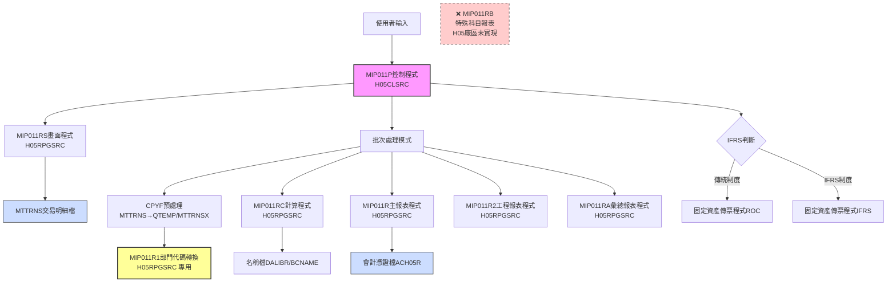
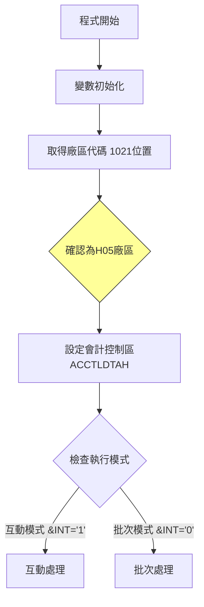
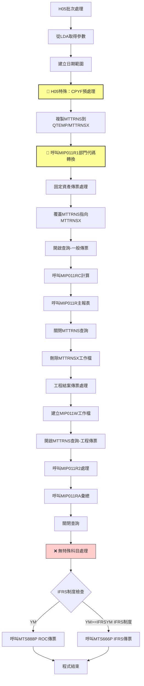
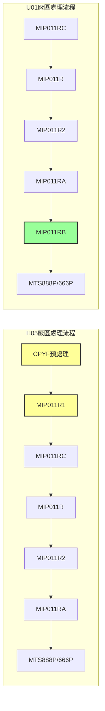
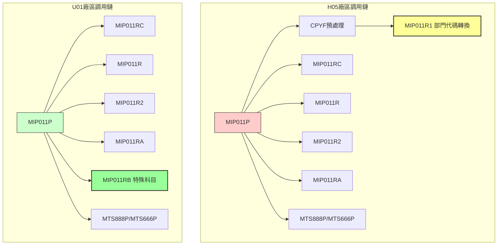

# MIP011P_H05 程式規格書

## 1. 基本資料
- **程式編號**：MIP011P
- **程式名稱**：固定資產月底傳票作業
- **程式類型**：CLP (控制語言程式)
- **程式位置**：H05CLSRC/MIP011P_H05.txt
- **開發人員**：JEFF（原始開發）、S00TPC（多次修改）
- **系統名稱**：物料庫存管理系統
- **子系統**：固定資產管理
- **開發日期**：83/07/28
- **最後修改**：102/04/16 2012MT635 S00TPC(0204A)

## 2. 程式功能說明
此程式為H05廠區的固定資產月底傳票作業批次控制程式，與U01版本相比具有特殊的部門代碼處理機制。

### 主要功能
1. **固定資產傳票處理**：處理月度固定資產相關的交易傳票
2. **IFRS轉換支援**：支援傳統會計制度與IFRS制度的轉換處理
3. **H05廠區專用處理**：包含特殊部門代碼轉換邏輯
4. **互動與批次模式**：提供互動式輸入和批次處理兩種執行模式
5. **傳票分類處理**：
   - 一般固定資產傳票（MI21、MI22）
   - 工程結案傳票處理
   - **⚠️ 不支援特殊科目傳票**（1371、1374）

### 🔍 H05廠區特色功能
- **特殊部門代碼處理**：通過MIP011R1程式處理H05專用部門代碼
- **中間檔案優化**：使用CPYF預處理提升效能
- **簡化科目處理**：不包含特殊科目1371、1374的處理邏輯

## 3. 檔案架構與關聯圖

### 視覺化架構圖


### 主要檔案清單
| 檔案名稱 | 類型 | 說明 | 用途 | H05特殊性 |
|---------|------|------|------|-----------|
| **MTTRNS** | 交易明細檔 | 存放固定資產交易明細 | INPUT | 經MIP011R1處理部門代碼 |
| **MTTRNSX** | 中間檔案 | QTEMP中的預處理檔案 | TEMP | H05專用中間處理 |
| **ACVOUR** | 會計憑證檔 | 動態命名ACH05R | OUTPUT | 固定為H05廠區 |
| **BCNAME** | 名稱檔 | DALIBR庫中的名稱主檔 | REFERENCE | 共用檔案 |
| **MIP011W** | 工作檔 | QTEMP中的臨時工作檔 | TEMP | 工程處理專用 |
| **AMIFRSCTL** | IFRS控制檔 | IFRS實施日期控制 | CONTROL | 共用控制檔 |

## 4. 🎯 欄位切割技術詳解

### 無DS結構切割
此程式為CLP程式，主要使用變數和資料區域(Data Area)進行資料操作，**未使用DS結構進行欄位切割**。

### 🎯 重要變數定義與用途分析

#### 日期相關變數切割技術
```
程式中的日期變數使用：
&DATEA (6字元) ← 從&DATE(數值型6位)轉換
&DATEN (8字元) ← 從&DATEE(數值型8位)轉換  
&DATEX (8字元) ← &YM + '01' (月初日期)
&DATEY (8字元) ← &YM + '31' (月底日期)
```

#### 🎯 資料區域挪用分析
程式大量使用*LDA(本地資料區域)進行資料傳遞：

| 位置 | 長度 | 變數 | 原始用途 | 實際挪用用途 | H05特殊處理 |
|------|------|------|----------|-------------|-------------|
| 1-6 | 6 | &P#YYMM | 年月參數 | 畫面輸入的處理年月 | 同U01版本 |
| 9-1 | 1 | &AREA | 廠區代碼 | 固定為'H'廠區識別 | 固定值'H' |
| 11-8 | 8 | &DATEN | 結束日期 | 月底處理日期 | 同U01版本 |
| 31-6 | 6 | &P#VRNS | 憑證號碼起 | 固定資產傳票起始號碼 | 同U01版本 |
| 41-6 | 6 | &P#VRNE | 憑證號碼迄 | 固定資產傳票結束號碼 | 同U01版本 |
| 472-6 | 6 | &IFRSYM | IFRS年月 | IFRS制度實施年月控制 | 同U01版本 |
| 1021-1 | 1 | &AREA | 廠區備份 | 從系統取得，固定為'H' | H05廠區專用 |

#### 🎯 挪用原因分析
1. **記憶體優化**：CLP程式中使用*LDA作為程式間參數傳遞的緩衝區
2. **標準化介面**：統一的資料區域位置便於多個子程式存取
3. **廠區隔離**：通過固定廠區代碼確保資料處理的廠區一致性

## 5. 輸出/入螢幕布局與說明

### 互動模式畫面（MIP011RS）
```
+----------------------------------------------------------+
|              固定資產月底傳票作業 (MIP011P)               |
|                       H05廠區專用                        |
+----------------------------------------------------------+
| 處理年月: [YYMMDD]    廠區: [H] H05廠區                  |
| 起始日期: [YYMMDD]    結束日期: [YYMMDD]                 |
+----------------------------------------------------------+
| 功能鍵: F3=離開 F12=取消                                |
+----------------------------------------------------------+
```

### 報表輸出說明
1. **固定資產傳票報表** - 158欄寬，12CPI格式
2. **工程結案報表** - 工程項目專用傳票
3. **彙總報表** - 各類別統計彙總
4. **❌ 無特殊科目報表** - H05廠區不支援1371、1374科目處理

## 6. 🎯 處理流程程序說明

### 主程序邏輯深度分析

#### 第一階段：初始化與模式判斷


#### 第二階段：H05特殊批次處理邏輯


### 🎯 H05廠區特殊業務邏輯分析

#### 1. MIP011R1部門代碼轉換邏輯
```
特殊部門代碼處理規則：
- H161 → 保持不變
- H213 → 保持不變  
- H215 → 保持不變
- H713 → 保持不變（96/08後）
- H753 → 保持不變（97/12後，原H713轉換）
- W041 → 保持不變（97/12後）
- W042 → 保持不變（113/03後）
- W043 → 保持不變（113/03後）
- H712 → 保持不變（104/10後，YM>=10410）
- H732 → 保持不變（104/10後，YM>=10410）
- 其他部門代碼 → 取前3碼+'0'
```

**業務意義**：H05廠區有特殊的部門代碼體系，需要特別的轉換邏輯

#### 2. CPYF預處理優化
```
CPYF FROMFILE(MTTRNS) TOFILE(QTEMP/MTTRNSX) 
     MBROPT(*ADD) CRTFILE(*YES) 
     INCREL((*IF I4LOCA *EQ &AREA) 
            (*AND I4DATE *GE &DATEX) 
            (*AND I4DATE *LE &DATEY))
```

**業務意義**：
- 先篩選出H05廠區的相關記錄
- 建立中間檔案提升後續處理效能
- 減少重複的資料掃描

#### 3. 無特殊科目處理
H05版本**不包含**以下邏輯：
```sql
-- U01版本有的特殊科目處理
I4ACNO *EQ "1371" *OR "1374"  -- H05版本不支援
```

**業務意義**：H05廠區的固定資產科目結構較簡單，不需要特殊科目處理

## 7. 🎯 數據操作與轉換分析

### 檔案操作詳解
1. **MTTRNS交易明細檔**：
   - **CPYF操作**：先複製到QTEMP/MTTRNSX進行預處理
   - **READ操作**：使用OPNQRYF對預處理檔案進行條件查詢
   - **UPDATE操作**：通過MIP011R1更新部門代碼
   - **篩選條件**：日期範圍、H05廠區、表單類型等多重條件

2. **ACVOUR會計憑證檔**：
   - **WRITE操作**：輸出固定資產傳票資料
   - **檔案命名**：固定命名為ACH05R
   - **UPDATE模式**：追加模式寫入

### H05特殊數據轉換邏輯
1. **部門代碼標準化**：
   - 特殊部門代碼保持不變
   - 一般部門代碼轉換為3碼+0格式
   - 時間相關的部門代碼啟用邏輯

2. **廠區代碼固定化**：
   - 所有處理固定為H05廠區
   - 檔案命名自動加上H05識別

3. **中間檔案優化**：
   - 使用QTEMP/MTTRNSX提升查詢效能
   - 自動清理臨時檔案

## 8. 錯誤處理程序說明
- **ACP101R檢查**：呼叫ACP101R進行月份檢查，返回代碼判斷處理
- **日期檢查**：在MIP011RS中進行日期格式和合理性檢查
- **檔案存在檢查**：使用MONMSG處理檔案不存在的情況
- **CPYF錯誤處理**：CPYF操作的錯誤處理和檔案建立邏輯
- **系統錯誤處理**：使用MONMSG CPF0000處理一般系統錯誤

## 9. 🎯 特殊技術實現說明

### H05廠區記憶體優化技術
1. **預處理檔案策略**：
   - 使用CPYF先篩選相關記錄到QTEMP
   - 避免重複掃描大型MTTRNS檔案
   - 提升後續查詢效能

2. **動態檔案命名**：
   - ACVOUR檔案固定映射到ACH05R
   - 會計控制區域固定命名為ACCTLDTAH

3. **部門代碼轉換優化**：
   - 通過MIP011R1集中處理部門代碼轉換
   - 避免在主程式中處理複雜邏輯

### H05廠區程式碼優化技巧
1. **分階段處理**：
   - 預處理階段：CPYF + MIP011R1
   - 主處理階段：標準固定資產傳票處理
   - 後處理階段：工程結案處理

2. **簡化設計**：
   - 移除特殊科目處理邏輯
   - 專注於H05廠區的標準業務流程

## 10. 🎯 跨廠區版本分析

### 版本分布情況
| 程式名稱 | H05 | K02 | U01 | P02 | 說明 |
|---------|-----|-----|-----|-----|------|
| **MIP011P** | ✅ | ✅ | ✅ | ❌ | 主控制程式 |
| **MIP011RS** | ✅ | ✅ | ✅ | ❌ | 畫面程式 |
| **MIP011R** | ✅ | ✅ | ✅ | ❌ | 主報表程式 |
| **MIP011RC** | ✅ | ✅ | ✅ | ❌ | 計算程式 |
| **MIP011R1** | ✅ | ❌ | ❌ | ❌ | **H05專用**部門代碼轉換 |
| **MIP011R2** | ✅ | ✅ | ✅ | ❌ | 工程報表程式 |
| **MIP011RA** | ✅ | ✅ | ✅ | ❌ | 彙總報表程式 |
| **MIP011RB** | ❌ | ✅ | ✅ | ❌ | **H05缺少**特殊科目報表 |

### 程式碼差異分析

#### 🔍 主要差異點詳細比較

**1. 歷史更新記錄差異**
| 版本差異 | H05版本 | U01版本 | 差異說明 |
|---------|---------|---------|----------|
| 9803A更新 | ✅ 98/03/06 | ❌ 無 | H05特有的更新 |
| 9905A更新 | ✅ 99/05/12 | ❌ 無 | H05特有的更新 |
| 0012A更新 | ✅ 100/12/16 | ❌ 無 | H05特有的更新 |

**2. 批次處理流程差異**
| 處理階段 | H05版本 | U01版本 | 差異說明 |
|---------|---------|---------|----------|
| **預處理** | CPYF + MIP011R1 | 直接處理 | H05有額外預處理步驟 |
| **一般傳票** | 對QTEMP/MTTRNSX查詢 | 對MTTRNS直接查詢 | H05使用預處理檔案 |
| **工程傳票** | 相同邏輯 | 相同邏輯 | 無差異 |
| **特殊科目** | ❌ 不處理 | ✅ 呼叫MIP011RB | H05缺少此功能 |

**3. 子程式調用差異**


### 功能差異說明

#### 🎯 H05廠區獨有功能
1. **部門代碼標準化處理**：
   - 通過MIP011R1程式處理特殊部門代碼
   - 支援時間相關的部門代碼啟用邏輯
   - 提供部門代碼的歷史演變支援

2. **檔案預處理優化**：
   - CPYF操作提前篩選相關資料
   - 減少主要處理階段的資料掃描時間
   - 優化大型檔案的處理效能

#### 🎯 H05廠區缺少功能
1. **特殊科目處理**：
   - ❌ 不支援1371、1374科目的特殊處理
   - ❌ 無MIP011RB報表程式
   - 影響：無法處理特定會計科目的固定資產

#### 🎯 與U01版本的業務邏輯差異
1. **固定資產處理範圍**：
   - **H05**：基本固定資產傳票 + 部門代碼轉換，無特殊科目
   - **U01**：完整功能，包含特殊科目1371、1374處理

2. **工程結案處理**：
   - **H05**：基本工程結案功能 + 部門代碼標準化
   - **U01**：基本工程結案功能

3. **報表輸出範圍**：
   - **H05**：三種報表（一般、工程、彙總）
   - **U01**：四種報表（增加特殊科目報表）

### 調用關係差異


### 系統整合影響評估
1. **跨廠區資料一致性**：
   - H05的部門代碼標準化可能影響跨廠區報表統計
   - 特殊科目的處理差異會影響集團層級的會計彙總

2. **維護複雜度**：
   - H05版本的MIP011R1增加了維護點
   - 部門代碼邏輯的時間相關性增加了測試複雜度

3. **功能一致性風險**：
   - H05缺少特殊科目處理可能導致業務功能不完整
   - 建議評估是否需要為H05增加MIP011RB功能

## 11. 備註
- **特殊注意事項**：
  - H05廠區有獨特的部門代碼轉換邏輯，需要特別維護
  - 缺少特殊科目1371、1374的處理能力，影響會計完整性
  - CPYF預處理機制提升效能但增加磁碟空間需求

- **版本更新記錄**：
  - 0204A (102/04/16)：新增BCNAME檔案的程式庫指定
  - 0112A (101/12/07)：新增IFRS制度支援
  - 0012A (100/12/16)：H05特有更新，可能與MIP011R1相關
  - 9905A (99/05/12)：H05特有更新
  - 9803A (98/03/06)：H05特有更新

- **技術債務和改善建議**：
  - 建議為H05廠區增加MIP011RB特殊科目處理功能
  - 考慮將部門代碼轉換邏輯標準化到其他廠區
  - 評估CPYF預處理機制是否適用於其他廠區

- **跨廠區整合建議**：
  - 統一固定資產科目處理邏輯，建議H05增加MIP011RB
  - 評估部門代碼標準化機制是否適用於K02、U01廠區
  - 建立跨廠區的固定資產處理效能基準測試 