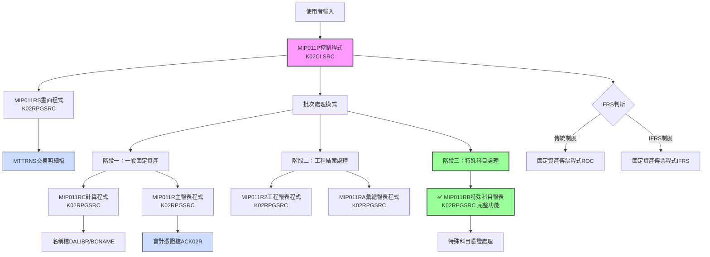
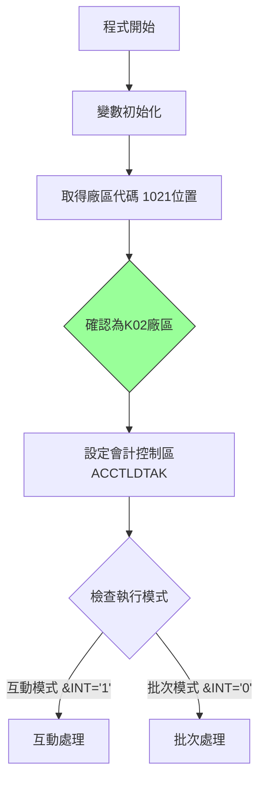
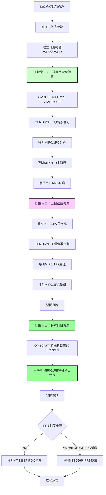
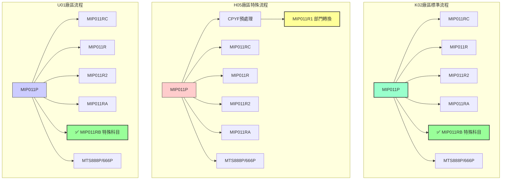
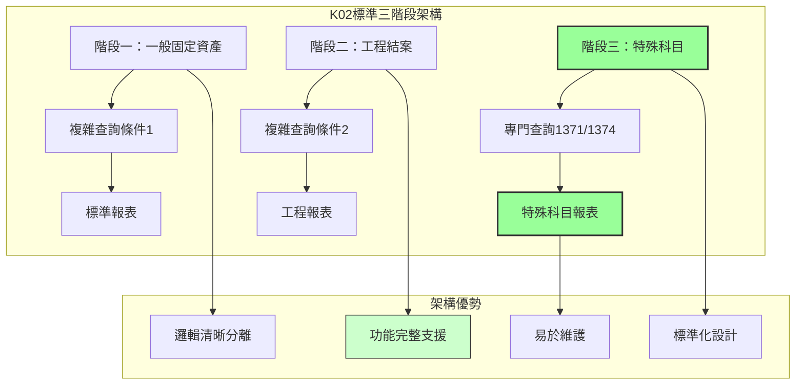

# MIP011P_K02 程式規格書

## 1. 基本資料
- **程式編號**：MIP011P
- **程式名稱**：固定資產月底傳票作業
- **程式類型**：CLP (控制語言程式)
- **程式位置**：K02CLSRC/MIP011P_K02.txt
- **開發人員**：JEFF（原始開發）、S00TPC（多次修改）
- **系統名稱**：物料庫存管理系統
- **子系統**：固定資產管理
- **開發日期**：83/07/28
- **最後修改**：102/04/16 2012MT635 S00TPC(0204A)

## 2. 程式功能說明
此程式為K02廠區的固定資產月底傳票作業批次控制程式，**是三個廠區中功能最完整的標準版本**。

### 主要功能
1. **完整固定資產傳票處理**：處理月度固定資產相關的交易傳票
2. **IFRS轉換支援**：支援傳統會計制度與IFRS制度的轉換處理
3. **三階段分類處理**：提供最完整的處理邏輯
4. **互動與批次模式**：提供互動式輸入和批次處理兩種執行模式
5. **傳票分類處理**：
   - **階段一**：一般固定資產傳票（MI21、MI22，排除1371、1374）
   - **階段二**：工程結案傳票處理（排除1371、1374）
   - **階段三**：✅ **特殊科目傳票**（專門處理1371、1374科目）

### 🔍 K02廠區標準功能特色
- **完整三階段處理**：唯一支援特殊科目1371、1374的完整處理流程
- **標準化查詢邏輯**：直接對MTTRNS檔案進行複雜條件查詢
- **平衡的功能設計**：兼顧效能與功能完整性
- **標準報表輸出**：提供四種完整報表（一般、工程、彙總、特殊科目）

## 3. 檔案架構與關聯圖

### 視覺化架構圖


### 主要檔案清單
| 檔案名稱 | 類型 | 說明 | 用途 | K02完整性 |
|---------|------|------|------|-----------|
| **MTTRNS** | 交易明細檔 | 存放固定資產交易明細 | INPUT | 直接查詢，無需預處理 |
| **ACVOUR** | 會計憑證檔 | 動態命名ACK02R | OUTPUT | 完整科目支援 |
| **BCNAME** | 名稱檔 | DALIBR庫中的名稱主檔 | REFERENCE | 共用檔案 |
| **MIP011W** | 工作檔 | QTEMP中的臨時工作檔 | TEMP | 工程處理專用 |
| **AMIFRSCTL** | IFRS控制檔 | IFRS實施日期控制 | CONTROL | 共用控制檔 |
| **AMDEPT** | 部門檔 | 部門代碼主檔 | REFERENCE | MIP011RB使用 |
| **MTMATL** | 物料檔 | 物料主檔 | REFERENCE | MIP011RB使用 |
| **ACCNTL** | 會計科目檔 | 會計科目主檔 | REFERENCE | MIP011RB使用 |
| **ACTRACL1** | 追蹤科目檔 | 追蹤科目控制檔 | REFERENCE | MIP011RB使用 |

## 4. 🎯 欄位切割技術詳解

### 無DS結構切割
此程式為CLP程式，主要使用變數和資料區域(Data Area)進行資料操作，**未使用DS結構進行欄位切割**。

### 🎯 重要變數定義與用途分析

#### 日期相關變數切割技術
```
程式中的日期變數使用：
&DATEA (6字元) ← 從&DATE(數值型6位)轉換
&DATEN (8字元) ← 從&DATEE(數值型8位)轉換  
&DATEX (8字元) ← &YM + '01' (月初日期)
&DATEY (8字元) ← &YM + '31' (月底日期)
```

#### 🎯 資料區域挪用分析
程式大量使用*LDA(本地資料區域)進行資料傳遞：

| 位置 | 長度 | 變數 | 原始用途 | 實際挪用用途 | K02標準處理 |
|------|------|------|----------|-------------|-------------|
| 1-6 | 6 | &P#YYMM | 年月參數 | 畫面輸入的處理年月 | 標準年月處理 |
| 9-1 | 1 | &AREA | 廠區代碼 | 固定為'K'廠區識別 | 固定值'K' |
| 11-8 | 8 | &DATEN | 結束日期 | 月底處理日期 | 標準日期處理 |
| 31-6 | 6 | &P#VRNS | 憑證號碼起 | 固定資產傳票起始號碼 | 標準憑證編號 |
| 41-6 | 6 | &P#VRNE | 憑證號碼迄 | 固定資產傳票結束號碼 | 標準憑證編號 |
| 472-6 | 6 | &IFRSYM | IFRS年月 | IFRS制度實施年月控制 | 標準IFRS控制 |
| 1021-1 | 1 | &AREA | 廠區備份 | 從系統取得，固定為'K' | K02廠區專用 |

#### 🎯 挪用原因分析
1. **標準化記憶體管理**：K02作為標準版本，展示了最佳實踐的記憶體使用方式
2. **模組化介面設計**：統一的資料區域位置便於各階段子程式存取
3. **廠區標準化**：為其他廠區提供標準化的資料結構參考

## 5. 輸出/入螢幕布局與說明

### 互動模式畫面（MIP011RS）
```
+----------------------------------------------------------+
|              固定資產月底傳票作業 (MIP011P)               |
|                    K02廠區標準版本                       |
+----------------------------------------------------------+
| 處理年月: [YYMMDD]    廠區: [K] K02廠區                  |
| 起始日期: [YYMMDD]    結束日期: [YYMMDD]                 |
+----------------------------------------------------------+
| 功能鍵: F3=離開 F12=取消                                |
+----------------------------------------------------------+
```

### 報表輸出說明
1. **固定資產傳票報表** - 158欄寬，12CPI格式（一般固定資產）
2. **工程結案報表** - 工程項目專用傳票
3. **彙總報表** - 各類別統計彙總
4. **✅ 特殊科目報表** - 1371、1374科目專用處理報表

## 6. 🎯 處理流程程序說明

### 主程序邏輯深度分析

#### 第一階段：初始化與模式判斷


#### 第二階段：K02標準三階段批次處理邏輯


### 🎯 K02廠區標準業務邏輯分析

#### 1. 階段一：一般固定資產傳票處理
```sql
查詢條件：
(CHAR6 >= DATEX) AND (CHAR6 <= DATEY) 
AND (I4LOCA = 'K') 
AND (I4FORM = "MI21" OR I4FORM = "MI22")
AND (((I4ENID = " ") AND (I4COMT = " ")) OR (I4COMT != " "))
AND (%SST(I4BK12 3 10) = " ")
AND (I4ACD != "D")
```

**業務意義**：處理所有基本固定資產交易，但排除特殊科目1371、1374

#### 2. 階段二：工程結案傳票處理
```sql
查詢條件：
(CHAR6 >= DATEX) AND (CHAR6 <= DATEY)
AND (I4LOCA = 'K')
AND (I4FORM = "MI21" OR I4FORM = "MI22")
AND (I4ENID != " ") AND (I4COMT = " ")
AND (%SST(I4BK12 3 10) = " ")
AND (I4ACD != "D")
AND (I4ACNO != "1371") AND (I4ACNO != "1374")
```

**業務意義**：專門處理工程結案相關傳票，排除特殊科目

#### 3. 階段三：特殊科目傳票處理（K02獨有完整功能）
```sql
查詢條件：
(CHAR6 >= DATEX) AND (CHAR6 <= DATEY)
AND (I4LOCA = 'K')
AND (I4FORM = "MI21" OR I4FORM = "MI22")
AND (I4ENID != " ") AND (I4COMT = " ")
AND (%SST(I4BK12 3 10) = " ")
AND (I4ACD != "D")
AND ((I4ACNO = "1371") OR (I4ACNO = "1374"))
```

**業務意義**：
- **1371科目**：通常為「租賃權益改良」或「土地改良物」
- **1374科目**：通常為「承租資產」或「使用權資產」
- 這些科目在IFRS制度下需要特殊的會計處理

## 7. 🎯 數據操作與轉換分析

### 檔案操作詳解
1. **MTTRNS交易明細檔**：
   - **直接查詢**：K02版本直接對原始MTTRNS檔案進行三次複雜查詢
   - **分階段讀取**：通過不同查詢條件區分一般、工程、特殊科目
   - **即時處理**：無需預處理或中間檔案，直接處理
   - **完整篩選**：支援最複雜的業務邏輯篩選

2. **ACVOUR會計憑證檔**：
   - **WRITE操作**：輸出完整的固定資產傳票資料
   - **檔案命名**：固定命名為ACK02R
   - **完整支援**：包含所有科目的憑證處理

### K02標準數據轉換邏輯
1. **分階段處理策略**：
   - 第一階段處理基礎固定資產
   - 第二階段處理工程相關
   - 第三階段處理特殊會計科目

2. **條件邏輯優化**：
   - 使用複雜的SQL條件組合
   - 通過科目代碼精確分類
   - 支援最完整的業務需求

3. **檔案命名標準化**：
   - 所有處理固定為K02廠區
   - 檔案命名遵循標準規範

## 8. 錯誤處理程序說明
- **ACP101R檢查**：呼叫ACP101R進行月份檢查，返回代碼判斷處理
- **日期檢查**：在MIP011RS中進行日期格式和合理性檢查
- **檔案存在檢查**：使用MONMSG處理檔案不存在的情況
- **查詢錯誤處理**：三階段查詢的個別錯誤處理邏輯
- **系統錯誤處理**：使用MONMSG CPF0000處理一般系統錯誤
- **特殊科目錯誤處理**：MIP011RB程式的特殊錯誤處理機制

## 9. 🎯 特殊技術實現說明

### K02廠區標準化技術架構
1. **分階段查詢策略**：
   - 避免單一複雜查詢的效能問題
   - 分別最佳化不同類型的處理邏輯
   - 提供清晰的業務邏輯分離

2. **動態檔案管理**：
   - ACVOUR檔案固定映射到ACK02R
   - 會計控制區域固定命名為ACCTLDTAK
   - MIP011W工作檔的動態建立和清理

3. **完整功能實現**：
   - 支援所有固定資產科目的處理
   - 提供最完整的報表輸出
   - 標準化的IFRS轉換支援

### K02廠區程式設計最佳實踐
1. **模組化設計**：
   - 每個階段獨立處理
   - 清晰的程式調用邏輯
   - 完整的功能封裝

2. **標準化實現**：
   - 直接對原始檔案查詢，無需預處理
   - 標準的SQL查詢條件設計
   - 完整的業務功能支援

3. **效能平衡**：
   - 在功能完整性和效能之間取得平衡
   - 合理的資源使用策略

## 10. 🎯 跨廠區版本分析

### 版本分布情況
| 程式名稱 | H05 | K02 | U01 | P02 | 功能完整度 |
|---------|-----|-----|-----|-----|-----------|
| **MIP011P** | ✅ | ✅ | ✅ | ❌ | K02最完整 |
| **MIP011RS** | ✅ | ✅ | ✅ | ❌ | 基本一致 |
| **MIP011R** | ✅ | ✅ | ✅ | ❌ | 基本一致 |
| **MIP011RC** | ✅ | ✅ | ✅ | ❌ | 基本一致 |
| **MIP011R1** | ✅ | ❌ | ❌ | ❌ | H05獨有 |
| **MIP011R2** | ✅ | ✅ | ✅ | ❌ | 基本一致 |
| **MIP011RA** | ✅ | ✅ | ✅ | ❌ | 基本一致 |
| **MIP011RB** | ❌ | ✅ | ✅ | ❌ | **K02完整功能** |

### 程式碼差異分析

#### 🔍 主要差異點詳細比較

**1. 歷史更新記錄比較**
| 版本差異 | H05版本 | K02版本 | U01版本 | 差異說明 |
|---------|---------|---------|---------|----------|
| 9806A更新 | ❌ 無 | ✅ 98/06/04 | ❌ 無 | K02特有更新 |
| 9807A更新 | ✅ 有 | ✅ 98/07/23 | ❌ 無 | 工程處理相關 |
| 9809A更新 | ❌ 無 | ✅ 98/09/21 | ❌ 無 | K02特有更新 |
| IFRS支援 | ✅ 101/12/07 | ✅ 101/12/07 | ✅ 101/12/07 | 統一實施 |

**2. 批次處理流程差異對比**
| 處理階段 | H05版本 | K02版本 | U01版本 | 功能說明 |
|---------|---------|---------|---------|----------|
| **預處理** | CPYF + MIP011R1 | ❌ 無預處理 | ❌ 無預處理 | H05獨有優化 |
| **一般傳票** | 預處理檔案查詢 | ✅ 直接查詢MTTRNS | ✅ 直接查詢MTTRNS | K02/U01標準做法 |
| **工程傳票** | 標準邏輯 | ✅ 標準邏輯 | ✅ 標準邏輯 | 三廠區一致 |
| **特殊科目** | ❌ 不支援 | ✅ **完整支援1371/1374** | ✅ 完整支援1371/1374 | K02/U01標準功能 |

**3. 子程式調用流程比較**


### 功能差異說明

#### 🎯 K02廠區作為標準版本的優勢
1. **功能最完整**：
   - ✅ 支援所有固定資產科目（包含1371、1374）
   - ✅ 提供四種完整報表輸出
   - ✅ 標準化的三階段處理邏輯

2. **架構最平衡**：
   - 無需特殊預處理（相較於H05）
   - 直接查詢原始檔案，邏輯清晰
   - 功能完整但不複雜

3. **維護性最佳**：
   - 無特殊部門代碼轉換邏輯
   - 標準化的查詢條件
   - 清晰的分階段處理

#### 🎯 與其他廠區的功能比較
1. **固定資產處理範圍對比**：
   - **H05**：基本固定資產 + 部門代碼轉換，無特殊科目
   - **K02**：✅ **完整功能，包含所有科目處理**
   - **U01**：完整功能，包含特殊科目處理

2. **系統架構對比**：
   - **H05**：預處理 + 轉換 + 基本功能
   - **K02**：✅ **直接處理 + 標準功能 + 完整支援**
   - **U01**：直接處理 + 完整功能

3. **報表輸出範圍對比**：
   - **H05**：三種報表（一般、工程、彙總）
   - **K02**：✅ **四種報表（一般、工程、彙總、特殊科目）**
   - **U01**：四種報表（一般、工程、彙總、特殊科目）

### 調用關係與架構優勢分析


### 系統整合影響評估
1. **跨廠區一致性標準**：
   - K02版本可作為其他廠區的功能標準參考
   - 建議H05廠區增加MIP011RB功能以達到K02標準

2. **維護複雜度最佳化**：
   - K02版本架構清晰，維護成本最低
   - 無特殊轉換邏輯，降低出錯風險

3. **業務功能完整性**：
   - K02提供最完整的固定資產會計處理
   - 特殊科目處理符合現代會計制度要求

4. **標準化推廣建議**：
   - 建議以K02版本為標準，統一其他廠區功能
   - H05廠區應考慮增加MIP011RB和移除預處理複雜性

## 11. 備註
- **標準版本地位**：
  - K02廠區版本為三廠區中功能最完整、架構最標準的版本
  - 建議作為其他廠區功能升級的參考標準
  - 特殊科目1371、1374的處理邏輯完整且符合會計制度

- **版本更新記錄**：
  - 0204A (102/04/16)：新增BCNAME檔案的程式庫指定
  - 0112A (101/12/07)：新增IFRS制度支援
  - 0012A (100/12/19)：K02版本特定更新
  - 9809A (98/09/21)：K02特有功能更新
  - 9807A (98/07/23)：工程處理相關更新
  - 9806A (98/06/04)：K02特有功能增強

- **技術架構建議**：
  - K02的三階段處理架構是最佳實踐範例
  - 直接查詢原始檔案的方式兼顧效能與清晰性
  - MIP011RB特殊科目處理是現代會計制度的必要功能

- **跨廠區整合建議**：
  - **推薦將K02版本設為標準**，其他廠區向此標準看齊
  - H05廠區建議增加MIP011RB功能並簡化預處理邏輯
  - U01廠區已具備完整功能，建議維持現狀
  - 建立以K02為基準的跨廠區功能一致性檢查機制 