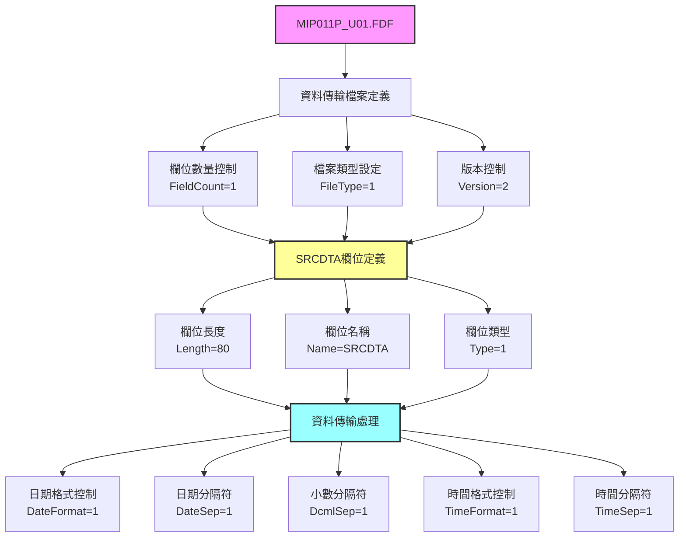
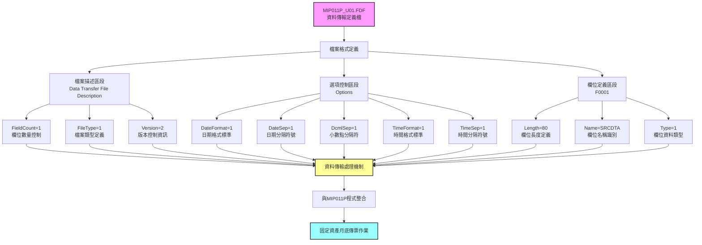
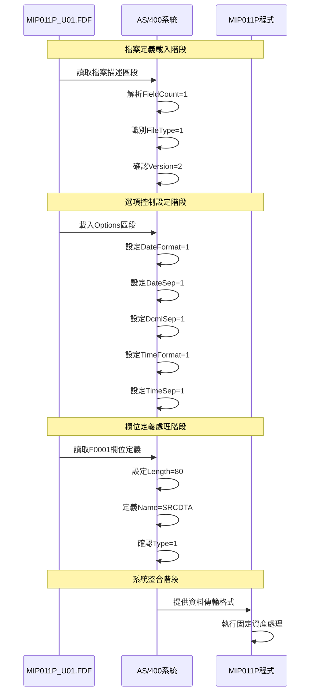
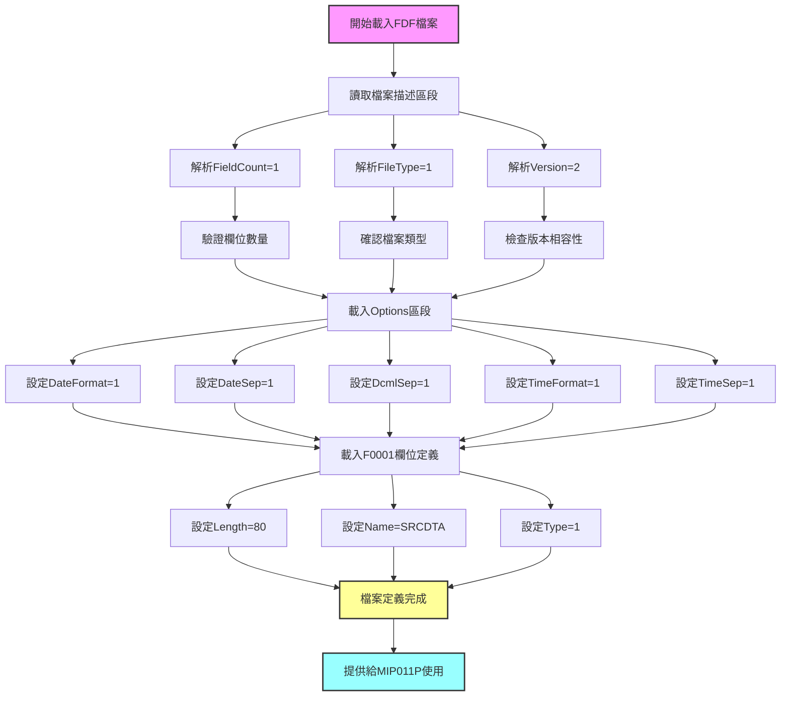

# MIP011P_U01.FDF 程式規格書

## 1. 基本資料

| 項目 | 內容 |
|------|------|
| **程式編號** | MIP011P |
| **程式名稱** | 固定資產月底傳票作業-資料傳輸檔案定義 |
| **程式類型** | FDF (資料傳輸檔案定義) |
| **廠區** | U01 |
| **系統名稱** | 庫存管理系統 |
| **子系統** | 固定資產管理 |
| **檔案位置** | 東鋼list/MIP011P_U01.FDF |

## 2. 🎯 程式功能說明

### 主要功能描述
MIP011P_U01.FDF是固定資產月底傳票作業的資料傳輸檔案定義檔，定義了AS/400系統中用於資料傳輸和交換的檔案格式規範。此檔案為MIP011P程式系列的配套檔案，專門處理U01廠區的固定資產資料傳輸格式定義。

### 🎯 業務流程詳細說明

#### 資料傳輸檔案架構


#### 檔案定義處理機制
1. **檔案結構初始化**：設定基本檔案參數和控制資訊
2. **欄位規格定義**：定義SRCDTA欄位的長度、類型和名稱
3. **格式選項控制**：設定日期、時間和數值的格式化選項
4. **資料類型管理**：統一的資料類型定義標準

#### 資料完整性確保機制
- **欄位數量驗證**：FieldCount參數確保資料欄位的一致性
- **版本控制機制**：Version=2提供檔案格式的版本管理
- **類型標準化**：Type=1統一的資料類型定義

## 3. 檔案架構與關聯圖

### 系統檔案清單

| 檔案名稱 | 檔案類型 | 使用方式 | 說明 |
|---------|---------|---------|------|
| MIP011P_U01.FDF | FDF定義檔 | 資料定義 | 固定資產傳輸檔案格式定義 |
| MIP011P | CLP | 關聯程式 | 固定資產月底傳票主程式 |
| MIP011RS | RPG | 關聯程式 | 參數收集程式 |
| SRCDTA | 資料欄位 | 資料容器 | 80字元源資料欄位 |

### 🎯 檔案關聯詳細視覺化圖表



### 🎯 資料流向詳細說明

#### 環境準備階段的資料流向


## 4. 🎯 檔案欄位規格說明

### 主要資料結構

#### 檔案描述區段 [Data Transfer File Description]
| 參數名稱 | 資料型態 | 長度 | 說明 | 設定值 |
|---------|---------|------|------|-------|
| FieldCount | 數值 | - | 檔案欄位數量 | 1 |
| FileType | 數值 | - | 檔案類型識別 | 1 |
| Version | 數值 | - | 檔案格式版本 | 2 |

#### 選項控制區段 [Options]
| 參數名稱 | 資料型態 | 長度 | 說明 | 設定值 |
|---------|---------|------|------|-------|
| DateFormat | 數值 | - | 日期格式控制 | 1 |
| DateSep | 數值 | - | 日期分隔符控制 | 1 |
| DcmlSep | 數值 | - | 小數分隔符控制 | 1 |
| TimeFormat | 數值 | - | 時間格式控制 | 1 |
| TimeSep | 數值 | - | 時間分隔符控制 | 1 |

#### 欄位定義區段 [F0001]
| 參數名稱 | 資料型態 | 長度 | 說明 | 設定值 |
|---------|---------|------|------|-------|
| Length | 數值 | - | 欄位長度定義 | 80 |
| Name | 字元 | - | 欄位名稱 | SRCDTA |
| Type | 數值 | - | 欄位資料類型 | 1 |

### 🔍 重點欄位切割技術詳解

#### 檔案結構分析
```
FDF檔案結構 (完整定義)：[描述區段|選項區段|欄位區段]
                        ↓        ↓      ↓
描述區段 (行1-4)：    [Data Transfer File Description]  檔案基本資訊
選項區段 (行5-9)：       [Options]                      格式控制選項  
欄位區段 (行10-14)：        [F0001]                     欄位定義規格
```

#### SRCDTA欄位結構
```
SRCDTA欄位 (80字元)：[................................................................]
位置範圍：            001────────────────────────────────────────────────080
                     ↓                                                    ↓
起始位置：            001                                                080
用途：               固定資產源資料容器                                  
類型：               Type=1 (字元型態)                                  
```

### 🎯 欄位挪用詳細分析

#### FDF檔案欄位使用方式對比表
| 參數名稱 | 原始定義 | 實際使用方式 | 挪用情況 |
|---------|---------|-------------|----------|
| FieldCount | 欄位數量控制 | 固定設為1 | 標準使用 |
| FileType | 檔案類型識別 | 固定設為1 | 標準使用 |
| Version | 版本控制 | 固定設為2 | 標準使用 |
| SRCDTA | 源資料欄位 | 80字元資料容器 | 標準使用 |

#### 欄位使用分析
所有欄位均按照標準定義使用，無挪用情況。檔案定義結構完整且規範，符合AS/400系統的資料傳輸檔案定義標準。

### 重要變數定義表

| 變數名稱 | 資料型態 | 用途說明 | 關聯區段 |
|---------|---------|---------|----------|
| FieldCount | 數值 | 控制檔案欄位數量 | Data Transfer File Description |
| FileType | 數值 | 定義檔案傳輸類型 | Data Transfer File Description |
| Version | 數值 | 管理檔案格式版本 | Data Transfer File Description |
| SRCDTA | 字元(80) | 固定資產源資料欄位 | F0001欄位定義 |

## 5. 🎯 輸出/入螢幕布局與說明

### 檔案定義顯示格式

#### FDF檔案內容結構布局
```
+------------------------------------------------------------------------------+
||                    MIP011P_U01.FDF 檔案定義內容                           |
+------------------------------------------------------------------------------+
|| [Data Transfer File Description]                                           |
|| FieldCount=1                                                               |
|| FileType=1                                                                 |
|| Version=2                                                                  |
||                                                                            |
|| [Options]                                                                  |
|| DateFormat=1                                                               |
|| DateSep=1                                                                  |
|| DcmlSep=1                                                                  |
|| TimeFormat=1                                                               |
|| TimeSep=1                                                                  |
||                                                                            |
|| [F0001]                                                                    |
|| Length=80                                                                  |
|| Name=SRCDTA                                                                |
|| Type=1                                                                     |
+------------------------------------------------------------------------------+
```

### 🎯 畫面欄位詳細說明

#### 檔案定義參數說明
| 區段名稱 | 參數名稱 | 設定值 | 屬性 | 說明 |
|---------|---------|-------|------|------|
| 檔案描述 | FieldCount | 1 | 數值/唯讀 | 檔案包含欄位數量 |
| 檔案描述 | FileType | 1 | 數值/唯讀 | 資料傳輸檔案類型 |
| 檔案描述 | Version | 2 | 數值/唯讀 | 檔案格式版本編號 |
| 格式選項 | DateFormat | 1 | 數值/唯讀 | 日期格式標準編號 |
| 格式選項 | DateSep | 1 | 數值/唯讀 | 日期分隔符類型 |
| 格式選項 | DcmlSep | 1 | 數值/唯讀 | 小數點分隔符類型 |
| 格式選項 | TimeFormat | 1 | 數值/唯讀 | 時間格式標準編號 |
| 格式選項 | TimeSep | 1 | 數值/唯讀 | 時間分隔符類型 |
| 欄位定義 | Length | 80 | 數值/唯讀 | SRCDTA欄位長度 |
| 欄位定義 | Name | SRCDTA | 字元/唯讀 | 欄位名稱識別 |
| 欄位定義 | Type | 1 | 數值/唯讀 | 欄位資料類型 |

### 🎯 畫面控制邏輯
此FDF檔案為靜態定義檔，無互動式畫面控制邏輯。所有參數均為系統讀取用的固定設定值。

## 6. 🎯 處理流程程序說明

### 🎯 主程序邏輯深度分析

#### 檔案定義載入流程圖


#### 🎯 詳細處理步驟逐一分析

**步驟1：檔案描述區段處理**
1. 讀取 `[Data Transfer File Description]` 標籤
2. 解析 `FieldCount=1` - 確認檔案包含1個資料欄位
3. 解析 `FileType=1` - 識別為標準資料傳輸檔案
4. 解析 `Version=2` - 確認使用版本2格式規範

**步驟2：選項控制區段處理**
1. 讀取 `[Options]` 標籤
2. 設定 `DateFormat=1` - 啟用標準日期格式
3. 設定 `DateSep=1` - 使用標準日期分隔符
4. 設定 `DcmlSep=1` - 使用標準小數分隔符
5. 設定 `TimeFormat=1` - 啟用標準時間格式
6. 設定 `TimeSep=1` - 使用標準時間分隔符

**步驟3：欄位定義區段處理**
1. 讀取 `[F0001]` 欄位標籤
2. 設定 `Length=80` - 定義欄位長度為80字元
3. 設定 `Name=SRCDTA` - 定義欄位名稱為SRCDTA
4. 設定 `Type=1` - 定義為字元型態欄位

#### 業務邏輯深度解析
FDF檔案的業務邏輯專注於資料傳輸格式的標準化定義：
- 統一的檔案結構規範
- 標準化的資料格式控制
- 一致的欄位定義方式
- 版本化的格式管理

#### 條件判斷詳細說明
FDF檔案為靜態定義檔，無條件判斷邏輯。所有設定均為固定值，確保資料傳輸的一致性和穩定性。

#### 變數使用和數據流向
- **FieldCount**：控制欄位數量，確保資料結構一致性
- **FileType**：標識檔案類型，供系統識別用途
- **Version**：版本控制，確保格式相容性
- **SRCDTA相關參數**：定義80字元資料欄位的完整規格

## 7. 🎯 數據操作與轉換分析

### 檔案操作詳解
此FDF檔案主要進行以下檔案操作：
- **READ操作**：系統讀取檔案定義內容
- **定義載入**：將格式定義載入系統記憶體
- **參數設定**：根據定義設定資料傳輸參數

### 數據轉換邏輯
FDF檔案的數據轉換主要體現在格式控制：
- **日期格式轉換**：DateFormat=1控制日期顯示格式
- **時間格式轉換**：TimeFormat=1控制時間顯示格式
- **分隔符轉換**：DateSep和TimeSep控制分隔符使用

### 計算邏輯分析
FDF檔案本身不包含計算邏輯，但其定義的80字元SRCDTA欄位為MIP011P程式提供資料容器：
- 欄位長度計算：Length=80確定資料容量
- 類型驗證計算：Type=1確保字元型態一致性

### 檢核機制詳解
FDF檔案透過以下機制確保資料完整性：
- **欄位數量檢核**：FieldCount=1確保結構一致
- **版本相容性檢核**：Version=2確保格式相容
- **類型一致性檢核**：Type=1確保資料型態正確

## 8. 🎯 錯誤處理程序說明

### 🎯 詳細錯誤代碼清冊

| 錯誤代碼 | 錯誤訊息 | 原因說明 | 處理方式 | 預防措施 |
|----------|---------|---------|---------|----------|
| **FILE001** | FDF檔案讀取失敗 | 檔案不存在或權限不足 | 1. 檢查檔案路徑<br>2. 確認讀取權限<br>3. 重新載入檔案 | 確保檔案完整性和適當權限設定 |
| **FILE002** | 檔案格式錯誤 | FDF格式不符合規範 | 1. 檢查檔案內容<br>2. 驗證格式結構<br>3. 重新產生FDF檔案 | 使用標準工具產生FDF檔案 |
| **FILE003** | 版本不相容 | Version參數不被支援 | 1. 檢查Version設定<br>2. 更新系統支援<br>3. 轉換檔案格式 | 維持版本參數在支援範圍內 |
| **FILE004** | 欄位定義錯誤 | Length或Type參數異常 | 1. 檢查欄位定義<br>2. 修正參數設定<br>3. 重新載入定義 | 遵循標準欄位定義規範 |
| **FILE005** | 選項設定錯誤 | Options區段參數異常 | 1. 檢查選項設定<br>2. 重設為預設值<br>3. 驗證設定有效性 | 使用標準選項設定值 |

### 🎯 系統異常處理邏輯
- **檔案載入失敗處理**：系統無法讀取FDF檔案時的替代機制
- **格式驗證失敗處理**：檔案格式不符規範時的錯誤恢復
- **參數異常處理**：定義參數超出範圍時的預設值設定
- **相容性檢查處理**：版本不相容時的向下相容機制

## 9. 🎯 備註

### 🎯 特殊注意事項
- FDF檔案為AS/400系統專用的資料傳輸檔案定義格式
- 檔案內容為純文字格式，採用INI檔案結構
- SRCDTA欄位長度固定為80字元，符合AS/400標準記錄長度
- 檔案版本為2，代表使用較新的格式定義標準
- 所有選項參數均設為1，採用系統預設的標準格式
- 此檔案與MIP011P主程式密切配合，提供資料傳輸格式定義
- 檔案定義內容為靜態設定，執行期間不會變更 