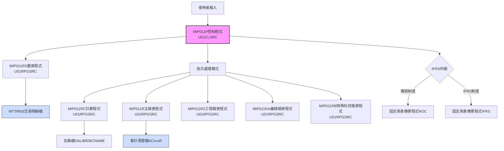
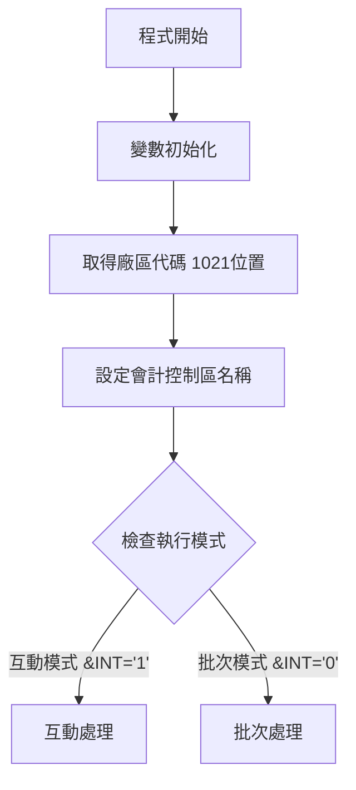
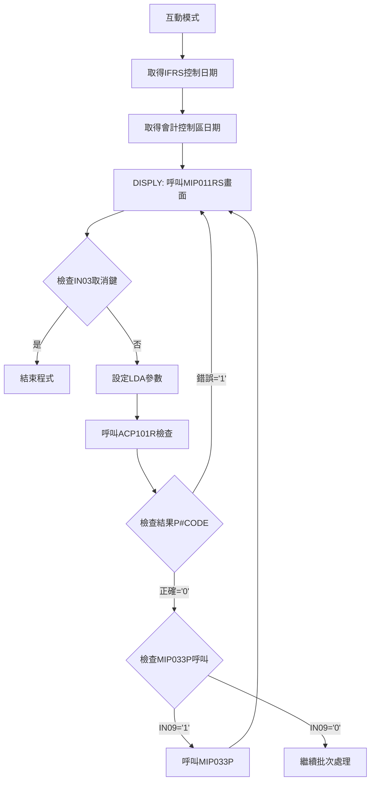
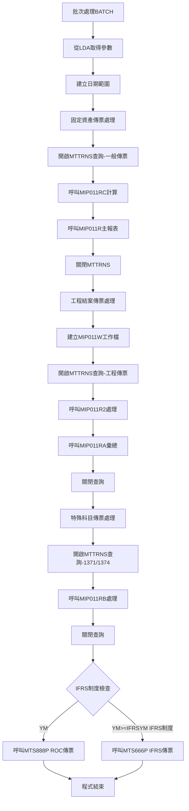
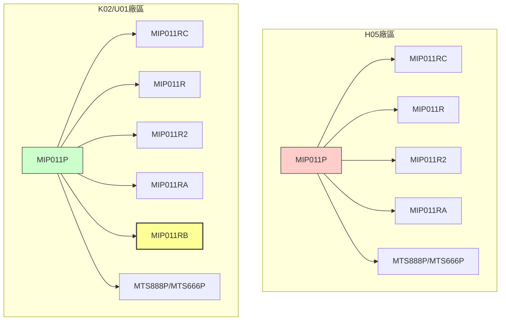

# MIP011P_U01 程式規格書

## 1. 基本資料
- **程式編號**：MIP011P
- **程式名稱**：固定資產月底傳票作業
- **程式類型**：CLP (控制語言程式)
- **程式位置**：U01CLSRC/MIP011P_U01.txt
- **開發人員**：JEFF（原始開發）、S00TPC（多次修改）
- **系統名稱**：物料庫存管理系統
- **子系統**：固定資產管理
- **開發日期**：83/07/28
- **最後修改**：102/04/16 2012MT635 S00TPC(0204A)

## 2. 程式功能說明
此程式為固定資產月底傳票作業的批次控制程式，主要功能包括：

### 主要功能
1. **固定資產傳票處理**：處理月度固定資產相關的交易傳票
2. **IFRS轉換支援**：支援傳統會計制度與IFRS制度的轉換處理
3. **多廠區處理**：支援H05、K02、U01三個廠區的固定資產作業
4. **互動與批次模式**：提供互動式輸入和批次處理兩種執行模式
5. **傳票分類處理**：
   - 一般固定資產傳票（MI21、MI22）
   - 工程結案傳票處理
   - 特殊科目傳票（1371、1374）

## 3. 檔案架構與關聯圖

### 視覺化架構圖


### 主要檔案清單
| 檔案名稱 | 類型 | 說明 | 用途 |
|---------|------|------|------|
| **MTTRNS** | 交易明細檔 | 存放固定資產交易明細 | INPUT |
| **ACVOUR** | 會計憑證檔 | 動態命名ACxxxR格式 | OUTPUT |
| **BCNAME** | 名稱檔 | DALIBR庫中的名稱主檔 | REFERENCE |
| **MIP011W** | 工作檔 | QTEMP中的臨時工作檔 | TEMP |
| **AMIFRSCTL** | IFRS控制檔 | IFRS實施日期控制 | CONTROL |
| **ACDTAARA** | 會計控制區 | 動態命名會計控制資料區 | CONTROL |

## 4. 🎯 欄位切割技術詳解

### 無DS結構切割
此程式為CLP程式，主要使用變數和資料區域(Data Area)進行資料操作，**未使用DS結構進行欄位切割**。

### 🎯 重要變數定義與用途分析

#### 日期相關變數切割技術
```
程式中的日期變數使用：
&DATEA (6字元) ← 從&DATE(數值型6位)轉換
&DATEN (8字元) ← 從&DATEE(數值型8位)轉換  
&DATEX (8字元) ← &YM + '01' (月初日期)
&DATEY (8字元) ← &YM + '31' (月底日期)
```

#### 🎯 資料區域挪用分析
程式大量使用*LDA(本地資料區域)進行資料傳遞：

| 位置 | 長度 | 變數 | 原始用途 | 實際挪用用途 |
|------|------|------|----------|-------------|
| 1-6 | 6 | &P#YYMM | 年月參數 | 畫面輸入的處理年月 |
| 9-1 | 1 | &AREA | 廠區代碼 | 當前處理廠區識別 |
| 11-8 | 8 | &DATEN | 結束日期 | 月底處理日期 |
| 31-6 | 6 | &P#VRNS | 憑證號碼起 | 固定資產傳票起始號碼 |
| 41-6 | 6 | &P#VRNE | 憑證號碼迄 | 固定資產傳票結束號碼 |
| 472-6 | 6 | &IFRSYM | IFRS年月 | IFRS制度實施年月控制 |
| 1021-1 | 1 | &AREA | 廠區備份 | 從系統取得的原始廠區代碼 |

#### 🎯 挪用原因分析
1. **記憶體優化**：CLP程式中使用*LDA作為程式間參數傳遞的緩衝區
2. **標準化介面**：統一的資料區域位置便於多個子程式存取
3. **向下相容性**：保持與舊版本程式的參數傳遞一致性

## 5. 輸出/入螢幕布局與說明

### 互動模式畫面（MIP011RS）
```
+----------------------------------------------------------+
|              固定資產月底傳票作業 (MIP011P)               |
+----------------------------------------------------------+
| 處理年月: [YYMMDD]    廠區: [X] U01廠區                  |
| 起始日期: [YYMMDD]    結束日期: [YYMMDD]                 |
+----------------------------------------------------------+
| 功能鍵: F3=離開 F12=取消                                |
+----------------------------------------------------------+
```

### 報表輸出說明
1. **固定資產傳票報表** - 158欄寬，12CPI格式
2. **工程結案報表** - 工程項目專用傳票
3. **特殊科目報表** - 1371、1374科目專用
4. **彙總報表** - 各類別統計彙總

## 6. 🎯 處理流程程序說明

### 主程序邏輯深度分析

#### 第一階段：初始化與模式判斷


#### 第二階段：互動模式處理邏輯


#### 第三階段：批次處理核心邏輯


### 🎯 關鍵業務邏輯分析

#### 1. IFRS制度判斷邏輯
```
IF (&YM *LT &IFRSYM) THEN(DO)
    /* 傳統制度ROC處理 */
    CALL PGM(MTS888P) PARM(&AREA &YM &P#VRNS &P#VRNE)
ELSE
    /* IFRS制度處理 */  
    CALL PGM(MTS666P) PARM(&AREA &YM &P#VRNS &P#VRNE)
ENDDO
```

**業務意義**：根據處理年月判斷使用傳統會計制度或IFRS制度的固定資產處理方式

#### 2. 固定資產傳票篩選條件
```sql
-- 一般固定資產傳票
I4ACD *NE "D"                    -- 非刪除記錄
I4CODE *EQ "1"                   -- 特定代碼
I4LOCA *EQ "廠區"                -- 指定廠區
I4FORM *EQ "MI21" *OR "MI22"     -- 固定資產表單
I4ENID *EQ " "                   -- 空白工程代號
I4COMT *EQ " "                   -- 空白註記
%SST(I4BK12 3 10) *EQ " "        -- BK12欄位特定位置為空白

-- 工程結案傳票
I4ENID *NE " "                   -- 非空白工程代號
I4ACNO *NE "1371"                -- 排除特定科目
I4ACNO *NE "1374"                -- 排除特定科目

-- 特殊科目傳票  
I4ACNO *EQ "1371" *OR "1374"     -- 僅處理特定科目
```

## 7. 🎯 數據操作與轉換分析

### 檔案操作詳解
1. **MTTRNS交易明細檔**：
   - **READ操作**：使用OPNQRYF進行條件查詢
   - **篩選條件**：日期範圍、廠區、表單類型等多重條件
   - **排序方式**：依廠區、部門、科目、項目等欄位排序

2. **ACVOUR會計憑證檔**：
   - **WRITE操作**：輸出固定資產傳票資料
   - **檔案命名**：動態命名為AC[廠區]R格式
   - **UPDATE模式**：追加模式寫入

### 數據轉換邏輯
1. **日期格式轉換**：
   - 數值型6位年月 → 字元型8位完整日期
   - YYMMDD → YYYYMMDD格式轉換

2. **廠區代碼處理**：
   - 從LDA 1021位置取得廠區代碼
   - 用於檔案命名和資料篩選

3. **傳票號碼處理**：
   - 從LDA 31、41位置取得憑證號碼範圍
   - 傳遞給固定資產傳票程式

## 8. 錯誤處理程序說明
- **ACP101R檢查**：呼叫ACP101R進行月份檢查，返回代碼判斷處理
- **日期檢查**：在MIP011RS中進行日期格式和合理性檢查
- **檔案存在檢查**：使用MONMSG處理檔案不存在的情況
- **系統錯誤處理**：使用MONMSG CPF0000處理一般系統錯誤

## 9. 🎯 特殊技術實現說明

### 記憶體優化技術
1. **資料區域重複使用**：
   - 同一LDA位置在不同處理階段存放不同資料
   - 位置1-6既存放輸入年月，也存放處理年月

2. **動態檔案命名**：
   - ACVOUR檔案動態映射到AC[廠區]R
   - 會計控制區域動態命名為ACCTLDTA[廠區]

3. **臨時檔案管理**：
   - 使用QTEMP/MIP011W作為工程處理工作檔
   - 程式結束時自動清除

### 程式碼優化技巧
1. **條件處理最佳化**：
   - 使用三個不同的OPNQRYF查詢分別處理不同類型傳票
   - 避免單一查詢的複雜條件判斷

2. **模組化設計**：
   - 分離互動處理和批次處理邏輯
   - 各種報表處理分別使用獨立的RPG程式

## 10. 🎯 跨廠區版本分析

### 版本分布情況
| 程式名稱 | H05 | K02 | U01 | P02 | 說明 |
|---------|-----|-----|-----|-----|------|
| **MIP011P** | ✅ | ✅ | ✅ | ❌ | 主控制程式，P02廠區無此程式 |
| **MIP011RS** | ✅ | ✅ | ✅ | ❌ | 畫面程式，P02廠區無此功能 |
| **MIP011R** | ✅ | ✅ | ✅ | ❌ | 主報表程式 |
| **MIP011RC** | ✅ | ✅ | ✅ | ❌ | 計算程式 |
| **MIP011R2** | ✅ | ✅ | ✅ | ❌ | 工程報表程式 |
| **MIP011RA** | ✅ | ✅ | ✅ | ❌ | 彙總報表程式 |
| **MIP011RB** | ❌ | ✅ | ✅ | ❌ | 特殊科目報表，僅K02、U01有 |

### 程式碼差異分析

#### 主要差異點
1. **IFRS支援時間差異**：
   - U01版本：101/12/07 (0112A) 開始支援IFRS
   - 各廠區IFRS實施時間不同，控制邏輯相同

2. **MIP011RB程式差異**：
   - **H05廠區**：無MIP011RB程式，不處理1371、1374科目
   - **K02、U01廠區**：有完整的特殊科目處理功能

3. **BCNAME檔案路徑**：
   - U01版本：DALIBR/BCNAME（明確指定程式庫）
   - 其他版本可能使用不同的程式庫路徑

### 功能差異說明
1. **固定資產處理範圍**：
   - H05：基本固定資產傳票，無特殊科目處理
   - K02/U01：完整功能，包含特殊科目1371、1374處理

2. **工程結案處理**：
   - 所有廠區：基本工程結案功能相同
   - 差異：特殊科目的後續處理

3. **報表輸出差異**：
   - H05：三種報表（一般、工程、彙總）
   - K02/U01：四種報表（增加特殊科目報表）

### 調用關係差異


## 11. 備註
- **特殊注意事項**：
  - P02廠區完全無此固定資產月底傳票功能
  - H05廠區無特殊科目1371、1374的處理能力
  - IFRS制度轉換需要確認各廠區實施時間

- **版本更新記錄**：
  - 0204A (102/04/16)：新增BCNAME檔案的程式庫指定
  - 0112A (101/12/07)：新增IFRS制度支援
  - 0011A (100/11/09)：新增固定資產傳票號碼控制

- **技術債務和改善建議**：
  - 建議統一各廠區功能，增加H05廠區的特殊科目處理
  - 考慮將P02廠區納入固定資產月底傳票處理範圍
  - 建議標準化BCNAME檔案路徑，避免各廠區路徑差異

- **跨廠區整合建議**：
  - 統一MIP011RB程式到所有廠區
  - 建立標準化的固定資產科目處理邏輯
  - 考慮開發統一的跨廠區固定資產彙總報表 